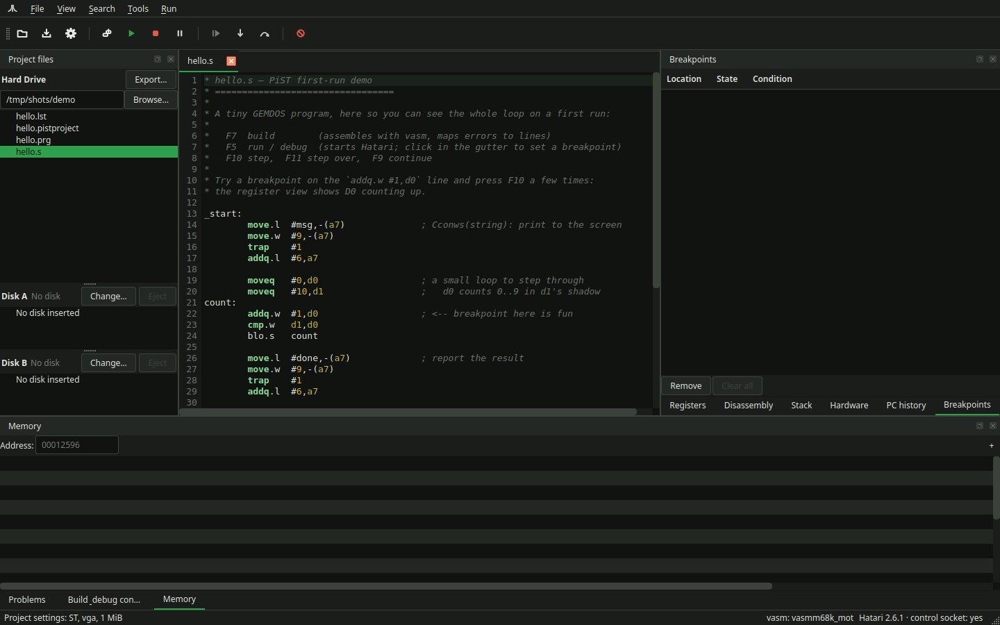
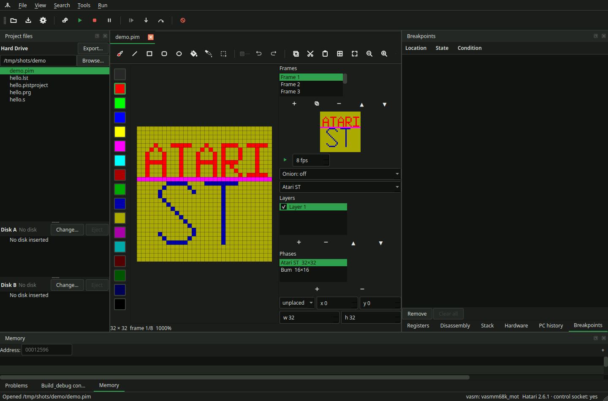

# PiST

[](https://github.com/idontwantyourspamthanks/PiST/actions/workflows/ci.yml)
[](https://github.com/idontwantyourspamthanks/PiST/releases)
[](LICENSE)

**An IDE for Atari ST assembly development.**

*Program in ST* — an IDE for writing 68000 assembly for the Atari ST.

Write 68000 assembly, assemble it, run it in an emulator, and debug it — without leaving the
editor. `PiST` bundles the pieces that are otherwise scattered across a text editor, a build
script, a terminal, a debugger and an emulator, and presents them as one tool.





> **Status: early, and usable.** The full loop works — write, assemble, run under Hatari, and
> debug with breakpoints, stepping, registers, memory, disassembly, watchpoints, a stack
> view and hardware registers, with the editor following the program counter. Projects have persistent settings (include paths, defines, machine, ROM,
> RAM, disk images). Linux, macOS and Windows all build and pass their tests in CI.
>
> What is missing is breadth rather than core function: the macOS archive still expects you to
> install Hatari (`brew install hatari`). The emulator integration is exercised in CI on Linux
> and macOS — Windows unit-tests only, since its stock Hatari never enters the debugger over
> pipes; see [Known limitations](#known-limitations).
> [docs/PLAN.md](docs/PLAN.md) has the full design.

---

## What it does

```
  write  ──▶  assemble  ──▶  run in Hatari  ──▶  debug
   .s         vasmm68k_mot        .prg            breakpoints, stepping,
                                                   registers, disassembly
```

- **Editor** with m68k Motorola-syntax highlighting, error markers and the current execution line,
  find/replace (**Ctrl+F** / **Ctrl+H**, F3 and Shift+F3, match highlighting as you type,
  match-case and whole-word options, and a hit counter that admits its cap — past 2000 it reads
  "N of more than 2000" rather than counting on), **Ctrl+click** to open an `include` or jump to a label,
  and a searchable **68000 instruction + TOS system-call reference** dock that follows
  the cursor — on a `trap #1`/`#13`/`#14` line (or a push feeding one) it names the
  GEMDOS/BIOS/XBIOS call being made and what it is being called with
- **Git** — a panel tabbed with Project files lists staged, changed and untracked
  files. Check the ones to commit, write a message, and commit (hooks run). The
  commit takes the **index**: the ticked rows are staged and the index is then
  committed with no pathspec, so a path already staged but left unchecked — or a
  conflicted path — is refused by name (include it, unstage it, or resolve it)
  rather than swept in or committed with its markers; PiST never rewrites your
  index. Pull and Push are the plain commands. The branch selector under the
  message switches branch; New… creates one. A switch that would overwrite local edits is refused.
  Select a row to see its diff: staged rows are the index, other rows the worktree.
  History lists commits, newest first; selecting one shows that commit.
  View → Git blame adds an author lane beside
  the line numbers; a click there does not toggle a breakpoint
- **Sprite editor** — File → New Image… (or open a `.pim`; import Degas `.PI1`,
  NeoChrome `.NEO`, IFF, PNG) to paint on a pixel grid with the STfm/STe palettes,
  layers, onion-skin, frames with an animated preview, and export to those formats
  plus STOS `.MBK`, an assembler include, and a raw bitplane `.dat` for `incbin`
  (palette, masked sprite, pre-shifted copies, every frame of the phase) with an
  optional ready-to-assemble scroller that animates it across the screen — see
  [Sprite bitplane data](#sprite-bitplane-data-dat). Importing adopts the file's palette
  as the active set. The select tool drags a rectangle you
  can move (drag inside it or nudge with the arrows), and copy, cut, paste
  (Ctrl+C/X/V) and delete; pasting keeps transparent pixels see-through.
- **Project files** — the left pane groups the host project (the GEMDOS hard drive) with Disk A
  and Disk B. Change or eject a floppy there (the same paths as in project settings); export
  selected hard-drive files to a new `.st` or `.msa` image
- **Project settings** — include paths, defines, target CPU, and the emulator's machine, ROM,
  monitor, RAM, hard disk and floppy images, saved beside the source in a small JSON file
- **Build** through `vasmm68k_mot`, with its diagnostics shown against the exact source line
  and toured from the keyboard (**F4** / Shift+F4); multi-file projects link with vlink, and a
  **symbols dock** lists every label and equate with its address once the program is running
- **Run** in [Hatari](https://www.hatari-emu.org/), launched with the project's settings
- **Debug** with breakpoints, single-step, step-over, **step out** and **run to cursor**
  (Ctrl+F10), registers, memory and labelled disassembly — and the editor following the
  program counter as you step
  - **edit registers and memory** while stopped — poke a value and keep debugging
  - **multiple memory panes**, each watching its own region
  - **Watchpoints** break when a memory value changes (Hatari has no data watchpoints, so they are
    armed as change-tracking breakpoints), settable from Run ▸ Add watchpoint or the remote control
  - a **stack view** of the values at the stack pointer, with likely return addresses marked
  - a **hardware registers** view of the shifter, MFP, ACIA/IKBD, sound, blitter and more, from
    Hatari's `info` commands
  - a **PC history** view of how the machine reached the current stop
  - an **interactive debugger console** — type any Hatari debugger command (`r`, `d`,
    `m $12596 20`, …) and see its output in the console dock, with arrow-key history and
    Tab completion of commands and symbol names
  - a **profiler**: Hatari's CPU profiling per *routine and source line* — put the cursor
    where measuring should end and **Profile to cursor line** does the rest (or drive
    Profile Start/Stop manually across several stops). Results land as a routines tree
    (counts *and* cycles, with milliseconds and frames), the OS's share as a TOS/ROM row,
    and heat in the editor gutter
- **Movable, tabbed debug panels** — arrange the views and the emulator display however you like;
  a hand cursor marks the drag surfaces (drag a title bar to move a panel between areas, drag a tab
  to rearrange), or right-click for a "Move to" menu. The layout persists. View → Layout applies
  Editing, Debugging and Sprite arrangements, and can restore the one they replaced.

The goal is *batteries included*: the toolchain and emulator ship with the IDE where their licences
allow and a usable version can be packaged, so there is nothing to assemble by hand before writing
your first line of code. The Linux AppImage and the Windows archive meet that goal today
(both bundle the emulator); the macOS archive still needs `brew install hatari`.

On a machine with no assembler or ROM, the first run offers a **guided setup**: a
checksum-pinned vasm source build and an EmuTOS download, each named with its URL and checksum
before anything is fetched. The button at the bottom of Project Settings reopens it.

## Target platform

Atari ST / STE (and, later, Mega ST, TT and Falcon) 68000 assembly, assembled with Motorola syntax.

The IDE itself is cross-platform: **Linux, Windows and macOS**.

## What it is built on

| Layer | Choice | Why |
|---|---|---|
| UI | Qt 6 (Widgets) | One codebase for all three platforms; strong tooling |
| Assembler | `vasmm68k_mot` | The de-facto standard for 68k assembly; excellent diagnostics |
| Emulator | Hatari | Accurate, actively maintained, and has a scriptable debugger |
| Line mapping | vasm's `-L` listing | Gives exact source-line ↔ address mapping with no DWARF and no cross-GDB |

A deliberate choice runs through all of this: **the assembler and emulator are driven as
subprocesses, through command-line arguments only.** They are never patched, never linked in, and
their configuration files are never rewritten. That keeps the integration small, keeps the licences
clean, and means a newer (or a user-supplied) toolchain just works.

## Architecture

```
┌──────────────────────────────────────────────────────────────────────┐
│  PiST  (Qt 6, GPL-2.0-or-later)                                      │
│                                                                      │
│  ┌────────────┐   ┌──────────────┐   ┌──────────────┐                │
│  │  Editor    │   │  Problems    │   │  Debug panels│                │
│  │  + ASM     │◀──│  pane        │   │  registers   │                │
│  │  highlight │   │              │   │  disassembly │                │
│  └────────────┘   └──────────────┘   │  memory      │                │
│         ▲                ▲           └──────▲───────┘                │
│         │                │                  │                        │
│         │           ┌────┴─────┐      ┌─────┴──────┐                 │
│         │           │ Build    │      │ Emulator   │                 │
│         │           │ Service  │      │ Host       │                 │
│         │           └────┬─────┘      └─────┬──────┘                 │
│         │                │                  │                        │
│         │           ┌────┴─────┐            │                        │
│         └───────────│ LineMap  │            │                        │
│           (PC↔line) │ (-L lst) │            │                        │
│                     └──────────┘            │                        │
└─────────────────────────────────────────────┼────────────────────────┘
                                              │
                          ┌───────────────────┴────────────────────┐
                          │ stdin · stdout · stderr · unix socket  │
                          └───────────────────┬────────────────────┘
                                              │
                                   ┌──────────┴──────────┐
                                   │   hatari            │  separate process;
                                   │   (GPL-2.0-or-later)│  never linked in
                                   └─────────────────────┘

        vasmm68k_mot ──▶ .prg + .lst        (separate process, CLI only)
```

### The debug transport

Stock Hatari's debugger has no GDB stub and no structured protocol, so the IDE drives it through the
channels it actually offers. That turned out to be the subtlest part of the project, and the
findings are worth knowing before touching the code:

- **The control socket is dead while the debugger is stopped.** Hatari only services it from its SDL
  event pump, so all debugger commands go over **stdin**. The socket is for control commands
  (`stop`/`continue`/option changes) while emulation is *running*.
- **The debugger prompt (`> `) is the command delimiter.** It marks the true end of a command, and
  which stream carries it depends on how Hatari was built.
- **Symbols are resolved in two phases**: stop at the program's entry point first (using Hatari's
  `TEXT` variable), *then* load symbols, because the program's load address is not known until it has
  been executed.
- **Source lines come from the listing**, not from DWARF: vasm's `-L` output maps each source line to
  a section offset, and the live base page supplies the section addresses.

These are all consequences of driving an emulator we do not control, and each one exists because a
test caught it. `docs/PLAN.md` §3.3 and §5 record them in full, along with the evidence.

**An alternative transport exists.** `IDebugBackend` abstracts the debug channel, with two
implementations: the native one above, and `HrdbBackend`, which speaks the typed TCP protocol of
the [hrdb-main fork of Hatari](https://github.com/tattlemuss/hatari) (upstream 2.6.1 plus a
remote-debug listener). The bundled emulator **is** that fork — the Linux AppImage and the Windows
archive ship it as `hatari`, and PiST detects it by binary content and selects HRDB automatically.
A stock Hatari you install yourself lands on the native transport; Project Settings → Debug
transport can force either. HRDB works on Windows, carries live section bases in its register reply,
and can pause a *running* program — the things the native transport cannot do where Hatari's
control socket is absent.

### Where the code lives

| Path | Contents |
|---|---|
| `src/main.cpp` | Entry point: platform pinning, `--diagnose`, `--control-port`, the single `MainWindow` |
| `src/ui/` | `MainWindow` (the shell) and every debug panel; X11 display embedding (`EmbedX11`, `EmulatorDisplayWidget`) |
| `src/editor/` | `CodeEditor` (gutter, execution line, error markers) and `AsmHighlighter` (m68k Motorola syntax) |
| `src/build/` | `BuildService` (drives vasm/vlink), `Diagnostic`, the line maps — `LineMap`, `LinkMap`, `ProgramLineMap` — and `FloppyImage` (`.st`/`.msa` plus the AUTO-folder writer) |
| `src/image/` | The sprite document and ST graphics: `ImageDocument` (v2 `.pim`), `Palette`, `Tools`, `Transform`, `StFormats` (PI1/NEO/IFF/MBK/PNG codecs, the `.dat`/scroller exporters) |
| `src/git/` | `GitService` (drives `git`, argument lists only) and `GitParse` (porcelain); the panel is `src/ui/GitPanel` |
| `src/emu/` | `IDebugBackend` (the transport contract) with `EmulatorHost` (stock Hatari, stdin/prompt framing) and `HrdbBackend` (hrdb-main fork, TCP 56001); `EmbedSocket` (the control socket), `MachineState`, `HatariTextParse`, `SessionConfig`, `HatariProbe`, `ProfileData`, `TosRom`, `Machine`, `MemoryDump`, `Paths` |
| `src/debug/` | `Breakpoint` (file:line model + arming plan) and `Watchpoint` |
| `src/control/` | `RemoteControl` — the localhost TCP line protocol that drives the IDE — and `mcp/`, the `pist-mcp` shim that exposes it as MCP tools |
| `src/project/` | `ProjectSettings` — the per-project `.pistproject` JSON |
| `src/toolchain/` | `Toolchain` — discovery of vasm, vlink and Hatari |
| `src/ui/SetupDialog.cpp` | First-run setup: checksum-pinned vasm source build and EmuTOS download |
| `tests/` | Parser unit tests and the offscreen GUI/emulator integration tests |
| `docs/` | Design documents — [PLAN](docs/PLAN.md), the [codebase guide](docs/ARCHITECTURE.md), [FUTURE](docs/FUTURE.md) |

## Building

Requirements: **CMake ≥ 3.21**, **Qt 6.5+** (Widgets and Network), a C++17 compiler.

```sh
cmake -S . -B build -G Ninja -DCMAKE_BUILD_TYPE=Release
cmake --build build
```

To try it without installing anything, `./run.sh` builds if needed and launches
the IDE with `demo/hello.s` open — a tiny program you can assemble, run and step
through to see the whole loop. `demo/demo.pim` is a sample sprite set for the
image editor — two phases ("Atari ST" 32×32, "Bum" 16×16) you can lay out on a
sprite sheet and export. It always uses your real display; run the tests
(below) for the headless checks.

Run the tests:

```sh
ctest --test-dir build --output-on-failure
```

There are two kinds of suite: the unit tests (always run, no emulator or display needed) and the
emulator/GUI integration tests, which skip themselves unless Hatari, `vasmm68k_mot` and a TOS ROM
are available — and `tst_hrdb` unless `$PIST_HRDB_HATARI` names the hrdb-main fork binary.

### Installing

Download an archive or installer from [Releases](../../releases) — a Linux AppImage plus
deb and RPM packages, a macOS dmg and tarball, and a Windows MSI and zip. All of them
carry PiST, the `vasmm68k_mot` assembler and an EmuTOS ROM; the Linux AppImage and the
Windows archive also carry **Hatari (the hrdb-main fork, 2.6.1-based)** — the Windows
one built with MSYS2 ucrt64 — so on those platforms a fresh download runs and debugs
with nothing else installed:

```sh
chmod +x PiST-x86_64.AppImage
./PiST-x86_64.AppImage your-program.s
```

The macOS archive does not bundle the emulator (the fork links Homebrew SDL2, and
rewiring those dylibs into the `.app` is unbuilt work), so install **Hatari** yourself
there — `brew install hatari` carries 2.6.1 — or point PiST at one in Project Settings.
Everything else is included, so the IDE assembles out of the box once Hatari is present.

To install from source instead:

```sh
cmake --install build --prefix ~/.local
```

which installs the binary, a desktop entry and icon (on Linux), and the licence
and third-party notices — but not vasm or Hatari, so see below.

To develop the IDE you will also want, at runtime:

- **`vasmm68k_mot`** — put it on `PATH` or set an explicit path in Project Settings; the release
  archives bundle it, and a source build needs your own (see [NOTICE](NOTICE) for its licence
  terms)
- **Hatari** — 2.6.1 is what the IDE is verified against; the Linux and Windows archives bundle a
  compatible fork, and a source build needs it on `PATH` or set in Project Settings (see
  [Platform support](#platform-support))
- **A TOS ROM, version 1.04 or later** — see [TOS ROMs](#tos-roms)

Both tools are discovered in this order, so no configuration is needed in the
common case:

1. an explicit path set in **Project Settings**;
2. beside the PiST executable (how release bundles are laid out);
3. `~/.local/share/PiST/tools` (`%LOCALAPPDATA%` on Windows) — the same place a
   bundled copy would live;
4. the system `PATH`.

If one is missing, PiST says which and where to get it rather than failing later
with a process error.

## Platform support

Every platform is built and tested on real runners by CI: **Linux, macOS and
Windows all compile warning-free and pass the full test suite**, and all three
install cleanly. See the badge in the Actions tab for the current state.

All three targets build and run a full assemble → run → debug session. One feature differs, because
of an upstream Hatari limitation rather than anything in `PiST`:

| Capability | Linux | Windows | macOS |
|---|---|---|---|
| Build, run, break at program entry | ✓ | ✓ | ✓ |
| Registers, memory, disassembly, stepping | ✓ | ✓ | ✓ |
| Breakpoints (set before launch) | ✓ | ✓ | ✓ |
| Break in when the program faults | ✓ | ✓ | ✓ |
| Pause a healthy running program | ✓ | ✗\* | ✓ |
| Change breakpoints while running | ✓ | ✗\* | ✓ |
| Swap disk images while stopped | ✓ | ✓ | ✓ |
| Swap disk images while the program is running | ✓ | ✗\* | ✓ |

\* Pause on Windows, and live breakpoint / running-disk changes there, work when the debug
transport is the [hrdb-main fork](https://github.com/tattlemuss/hatari) (Project Settings → Debug
transport), which speaks typed TCP instead of the POSIX-only control socket. The Windows release
archive bundles exactly that fork, so a fresh download is unaffected; a user-installed *stock*
Hatari on Windows still lacks those *while the program is running*, and a stopped session can
still insert or eject a floppy via the debugger (`setopt`).

The three gaps are all downstream of one thing: Hatari's control channel is compiled only on
POSIX systems (`HAVE_UNIX_DOMAIN_SOCKETS`), and it is the only way to command an *already running*
emulator. `PiST` detects this and omits the option rather than passing it and failing to start.
Everything else works everywhere, because debugger commands travel over stdin — the control socket
is starved whenever the debugger is stopped anyway, so it was never carrying the debug traffic.

Removing that gap is a small, well-understood upstream patch. It is written up, with the proposed
approach, in **[docs/FUTURE.md](docs/FUTURE.md)**.

## Linker

Multi-file projects are assembled separately and linked with **vlink**, from the
same author as vasm and under the same licence terms (unmodified redistribution,
non-commercial use). Release archives bundle it beside the assembler; a source
build needs it installed separately if you use more than one source file:

```
http://sun.hasenbraten.de/vlink/
```

It builds with plain `make`. A single-file project needs no linker at all.

## Sprite bitplane data (`.dat`)

**File ▸ Export Bitplane Data…** writes one phase of the focused sprite as raw ST bitplanes — the
blob an `incbin` pulls in — and the dialog says which phase, which blocks, and where each one lands.
Every frame of the phase goes into the file, so an animation arrives as one blob. The blocks come in
this order, each only when selected:

| Block | Contents |
|---|---|
| `palette` | 16 colour words (32 bytes), registers 0–15, ready to copy straight into `$ff8240` |
| `sprite_f0`, `sprite_f1`, … | each frame's four bitplanes in screen format: a row is a run of 16-pixel groups, each group plane 0–3 (4 words) |
| `sprite_masked_f0`, … | the same rows, each group preceded by its mask word (5 words per group) |
| `sprite_shift0..N-1_f0`, … | the pre-shifted copies: N is 2, 4 or 8, and copy k is `16/N × k` pixels to the right |
| `sprite_masked_shift0..N-1_f0`, … | the pre-shifted copies, each with its mask words |

Frames are written one after another, and every frame is the same size, so frame f of a block is
`base + f × frameStride`: an animation is a stride, not a pointer table.

A width that is not a whole number of groups is padded up to one, and a pre-shifted copy is one
group wider than the frame so the pixels a shift pushes off its right edge still fit. Every copy of a
pre-shifted block has the same stride, so the source for shift k is `base + k × copyStride`, and copy
0 is the unshifted picture in that wider row — no shift needs a special case.

A mask bit is set where the pixel is *not* drawn — a pixel that is not painted, or the palette
colour the dialog nominates as the **transparent** one (colour 0, the background register, unless
changed; it can also be set to `None`, which leaves only unpainted pixels out). A colour that is left
out is absent from the planes as well, so the blit keeps the screen there and has nothing to OR over
it. The blit therefore ANDs the screen with the mask and ORs the planes over it, with no complement
step:

```asm
        move.w  (a0)+,d3        ; mask: a 1 bit keeps the screen underneath
        and.w   d3,(a1)
        move.w  (a0)+,d1
        or.w    d1,(a1)+        ; plane 0, then planes 1, 2, 3
```

The export also leaves the block map in the console as `equ`s, so the offsets are still to hand
after the dialog closes:

```
sprite_shift0_f0        equ $04a0
sprite_masked_shift0_f3 equ $1ca0
```

**Also write a scroller (.s)** puts a ready-to-assemble GEMDOS program beside the `.dat`, under the
same name, that shows the phase off. It `incbin`s the `.dat` — vasm looks for it beside the source
it is assembling, so the pair travels together — and addresses every block through those same
`equ`s. It takes over supervisor mode, swaps in this palette, clears the screen, then animates and
scrolls the sprite across it: one step per VBL, each animation frame held for `kFrameTicks`, until a
key is pressed, when it puts the palette back and returns to TOS. `F7` builds it like any other
source in PiST. It asks XBIOS `Getrez` first: it wants a colour monitor (RGB/VGA/TV), which is what
the 320×200 four-bitplane screen needs — PiST's default project settings use the mono monitor, which
boots TOS in high resolution, and there it says so and waits for a key instead of drawing. The step it moves in is the pre-shift step, so
ticking a pre-shifted block is what makes the motion fine (2 px with 8 copies).

## Emulator embedding

On Linux, `PiST` can run the emulator's display **inside the IDE** instead of in a
separate window: **View ▸ Embed emulator display**. The mechanism is X11
reparenting — the emulator attaches its own window into a panel in the IDE — so
it works on X11 and, under Wayland, through XWayland. The preference is
remembered. Where reparenting is not possible (Wayland without XWayland, and for
now macOS and Windows), the option is unavailable and the emulator always runs as
a separate window, which remains the default everywhere.

## TOS ROMs

`PiST` does **not** ship original Atari TOS ROMs: they remain copyrighted, so you must supply your
own. [EmuTOS](https://emutos.sourceforge.net/) is a free, GPL-licensed alternative that works well.

ROMs are discovered in the standard Hatari data locations, next to the emulator executable, or in
the directory named by the `PIST_TOS_DIR` environment variable:

```sh
PIST_TOS_DIR=~/atari/roms ./build/pist
```

**TOS 1.04 or later is required.** Hatari cannot autostart a program from a GEMDOS hard disk on
older TOS versions, so the run-and-debug workflow depends on it. `PiST` reads the version field from
the ROM image's header — the same field Hatari itself reads — and tells you if the image you have is
too old. If the version cannot be determined, it asks before running, because a too-old ROM
otherwise fails *silently*: the emulator boots, the program never starts, and debugging never
attaches. (A run started over the remote-control socket has nobody to answer that question, so it
takes the AUTO-folder floppy path — which works on every TOS version — and says so in the console.)
A ROM that is *known* too old never asks: it boots via the AUTO-folder floppy, on either path.

## Remote control (driving the IDE from a script or an AI agent)

`PiST` can be driven from another program — a build script, a test harness, or an
AI agent — over a small text protocol, instead of by synthesising keyboard and
mouse input (brittle) or by reading the screen (worse). It is the same idea as
the control socket the emulator itself exposes, and PiST speaks both ends of
that arrangement.

The server is **off by default** and listens on localhost only; an IDE that opens
a network port unasked would be a surprise. Enable it with a flag or an
environment variable:

```sh
./pist --control-port 9999 your-program.s
PIST_CONTROL_PORT=9999 ./pist your-program.s
```

The first line on every connection must be the session token, as `auth <token>`
— on a shared machine, "localhost only" still means every local user. A
listening IDE writes the port and token to a discovery file,
`PiST/PiST/control-port` under the platform's user-data directory
(`~/.local/share` on Linux, `~/Library/Application Support` on macOS,
`%LOCALAPPDATA%` on Windows) — owner-read-only, as is its directory, so
anything the user runs can find them and nobody else can. A wrong or missing
token is answered `error auth required` and the connection is dropped. After
that, send one command per line. Replies
are a single line (`ok` or `error <message>`) or, for queries that return text,
a block: a status line (`ok`, or `error` for a failed query) followed by the
body and a closing line containing only `.`. A body line that *begins* with `.`
is sent with one extra leading `.`, and the reader strips one to recover it, so a
body that legitimately contains a lone `.` cannot end the block early. A failed
block-typed query is an `error` block too, so a reader waiting for the
terminator always unblocks:

```
open <path>        open a source file
read               the current document as a JSON object {path, text} (block reply)
build              assemble; the reply arrives when the build finishes
run                build and start the emulator; the reply arrives when it is running
stop               stop the emulator session
step / stepover / continue
breakpoint <n|label>  toggle a breakpoint at source line n or a symbol's definition
symbols [filter]   the build's symbols as a JSON array (block reply)
tabs               the open documents as a JSON array (block reply)
save               save the current document
readmem <addr> <len>  read memory as JSON rows of hex bytes (block reply, when stopped)
disasm [addr]      disassembly as JSON rows (block reply, when stopped)
watchpoint <addr>  break when the value at an address changes
setreg <name> <value>   set a register (while stopped)
setmem <addr> <value>  write a memory byte (while stopped)
cmd <command>      run an arbitrary Hatari debugger command (block reply)
screenshot <file>  save the window as a PNG (default /tmp/pist-screenshot.png)
console            the build & debug console text (block reply)
state              registers and PC (block reply)
statejson          registers and PC as a JSON object (block reply)
problems           the Problems pane as a JSON array (block reply)
profile start|stop|results   collect execution counts; results are a JSON
                   array of {line, count}, hottest first (block reply)
watch              receive events as the session changes state (see below)
unwatch            stop receiving events; the connection stays open
help               list the commands
quit               close the IDE
```

`build` and `run` answer only once the work is actually done, so a script does
not have to poll: `run` returning `ok` means the emulator session is up.

### Events: not having to poll for a stop

`watch` turns the connection into an event stream. The reply to `watch` is the
usual `ok`, and after it the server pushes one line per state change, without
waiting to be asked:

```
event stopped pc=0x12596
event running
```

The format is `event <name>` with optional trailing detail, always one line. The
IDE currently publishes `stopped` (with the program counter, when known) and
`running`; more event names may be added, so a client should ignore names it does
not recognise rather than treat them as errors. Watching is additive: a watcher
still gets ordinary replies to ordinary commands, and a connection that never
sends `watch` behaves exactly as it always did. Several connections may watch at
once. Send `unwatch` to stop the events while keeping the connection, or just
close it. Because `watch` and its `ok` share the socket with the events, a client
must read the `ok` before treating subsequent lines as events.

The `pist-mcp` shim (below) wraps this so an MCP client sees it as a push.

## MCP server (`pist-mcp`)

`pist-mcp` is a small companion program that exposes the same capability over
[Model Context Protocol](https://modelcontextprotocol.io) on stdio, so an MCP
client — Claude, Cursor and the like — discovers the IDE as a native tool set
rather than being taught a line protocol:

```sh
pist --control-port 9999 your-program.s &   # start the IDE with control on
PIST_CONTROL_PORT=9999 pist-mcp             # the client launches this instead
```

Point the client at the `pist-mcp` binary; the control port comes from `--port`
or `PIST_CONTROL_PORT`, matching how `pist` itself resolves it, and the session
token from `--token` or `PIST_CONTROL_TOKEN` — and with none of those, both
come from the discovery file a `pist --control-port` session publishes, so a
locally started IDE needs no configuration at all. The tools are
`pist_run`, `pist_build`, `pist_stop`, `pist_step`, `pist_stepover`,
`pist_continue`, `pist_state`, `pist_console`, `pist_problems`,
`pist_breakpoints`, `pist_breakpoint`, `pist_setreg`, `pist_setmem`,
`pist_watchpoint`, `pist_cmd`, `pist_screenshot`, `pist_open`, `pist_read`,
`pist_symbols`, `pist_readmem`, `pist_disasm`, `pist_tabs`, `pist_save`,
`pist_profile_start`, `pist_profile_stop`, `pist_profile_results` and
`pist_watch`. Read-only tools carry `readOnlyHint`, and the ones that end or
rewrite live state (`pist_stop`, `pist_setreg`, `pist_setmem`) carry
`destructiveHint`, so a client can decide what needs your confirmation.
`pist_state`, `pist_problems`, `pist_symbols`, `pist_readmem`,
`pist_disasm`, `pist_tabs` and `pist_profile_results` answer with structured JSON (in
`structuredContent` as well as text), so an agent consumes fields instead of
parsing console text. `pist_watch` subscribes to
the events above and returns them; they also arrive as MCP log notifications,
so an agent waiting for a breakpoint does not have to poll. The shim speaks
newline-delimited JSON-RPC 2.0 — one message per line, never `Content-Length`
headers, which belong to a different protocol — and logs to stderr only, since
stdout is the transport.

Beyond tools, the shim serves MCP **resources** — `pist://console`,
`pist://state` and `pist://document`, with `pist://state` subscribable (its
updates push on every stop/resume) — and two **prompts**: `diagnose-build`
(work the Problems pane to fixes) and `find-hot-loop` (profile and report
the hot lines).

A minimal client in Python, taking the address and token from the discovery
file:

```python
import socket
from pathlib import Path
host, port, token = (Path.home()          # Linux path; see above for macOS/Windows
    / ".local/share/PiST/PiST/control-port").read_text().split()
s = socket.create_connection((host, int(port)))
def cmd(line, block=False):
    s.sendall((line + "\n").encode())
    if not block:
        return s.recv(4096).decode().strip()
    out = b""
    while not out.endswith(b"\n.\n"):
        out += s.recv(4096)
    lines = out.decode().splitlines()
    if lines[0] != "ok":                  # a failed block-typed query is an `error` block
        raise RuntimeError("\n".join(lines[1:-1]))
    body = [ln[1:] if ln.startswith("..") else ln for ln in lines[1:-1]]  # un-stuff
    return "\n".join(body)

print(cmd(f"auth {token}"))              # ok — every connection opens this way
print(cmd("run"))                        # ok, once the session is up
cmd("screenshot /tmp/pist.png")          # save the window (including the embedded display)
print(cmd("state", block=True))          # registers: the status line is dropped, the body un-stuffed
```

The token makes "localhost only" safe on a shared machine; still do not forward
or expose the socket. It is a debugging and automation aid, not a general IPC
mechanism. The `screenshot` command raises the window first, so it reflects
what is actually on screen.

## Licence

`PiST` is free software under the **GNU General Public License, version 2 or later**
(see [LICENSE](LICENSE)). Contributions are welcome under the same terms.

Bundled or invoked third-party components keep their own licences. In particular `vasm` is *not*
free software (it permits unmodified, non-commercial redistribution, which is why the IDE never
patches it), and Qt is used under the LGPL. The Hatari bundled in the Linux AppImage and the
Windows archive is the [hrdb-main fork](https://github.com/tattlemuss/hatari) (upstream 2.6.1 plus
the remote-debug listener PiST's HRDB transport uses), redistributed unmodified from a
checksum-pinned commit tarball and conveyed under **GPL version 2**: three of the files Hatari
compiles in grant version 2 alone, so the build pins `-DCMAKE_DISABLE_FIND_PACKAGE_Readline=ON`
and the GPLv3 GNU Readline neither joins it nor travels in any archive. See [NOTICE](NOTICE) and
[docs/PLAN.md](docs/PLAN.md) §7 and §10 for the full breakdown and the obligations that follow.

## Known limitations

Stated plainly, because an early release should not imply more than it does:
- **The emulator integration is exercised in CI on Linux and macOS.** Both
  build the pinned Hatari 2.6.1 *and* the hrdb-main fork from source and run
  the emulator suites against both transports. Windows builds and unit-tests
  only: the official Windows Hatari is a GUI-subsystem binary whose debugger
  never answers over pipes, and our MSYS2 build of the fork does not get the
  suite to a session either — so the Windows-bundled fork is **experimental**,
  and bug reports from real Windows machines are especially useful.
- **On stock Hatari, pause, changing breakpoints while running, and swapping disks at runtime
  do not work on Windows.** Hatari compiles its control channel only on POSIX systems, and
  the official Windows build is a GUI-subsystem binary whose debugger does not answer over
  pipes at all (see the bullet above). The bundled emulator is the hrdb-main fork — marked
  experimental on Windows until reports from real machines come in. See
  [docs/FUTURE.md](docs/FUTURE.md) for the upstream fix that would cover stock Hatari.
- **Installers and plain archives** — Linux gets an AppImage plus deb and RPM packages,
  macOS a dmg and a tarball, Windows an MSI and a zip.
- **Hatari is bundled in the Linux AppImage and the Windows archive.** Both copies are the
  hrdb-main fork (upstream 2.6.1 plus the remote-debug listener), redistributed unmodified
  from a checksum-pinned commit tarball — the Windows one built with MSYS2 ucrt64 with its
  runtime DLLs beside the exe, and **experimental** there until real-machine reports confirm
  it — so they debug with nothing else installed, over HRDB. The
  macOS archive does not include it (`brew install hatari` is 2.6.1), and neither does a
  source build. Avoid distribution packages on Linux: Ubuntu 22.04 ships 2.3.1 and 24.04
  ships 2.4.1, whose truncated debugger responses break source-line debugging, while the
  IDE is developed and verified against 2.6.1.
- Multi-file projects are supported through the linker (add sources in Project
  Settings; release archives bundle `vlink`, a source build needs it installed).
- The interface is functional rather than polished.

## Documentation

- **[docs/ARCHITECTURE.md](docs/ARCHITECTURE.md)** — a guide to the codebase: the module map, the
  build/run/debug flows, the hard-won invariants, and how to extend it. Start here to change code.
- **[docs/PLAN.md](docs/PLAN.md)** — the design document: verified findings, architecture
  rationale, the launcher rules, roadmap, risk register and licensing analysis
- **[docs/FUTURE.md](docs/FUTURE.md)** — deferred work, with the reasoning and the starting point for
  each item (notably: a portable emulator control channel, which is what Windows is missing)
- **[NOTICE](NOTICE)** — third-party components and the licence obligations that follow from them
