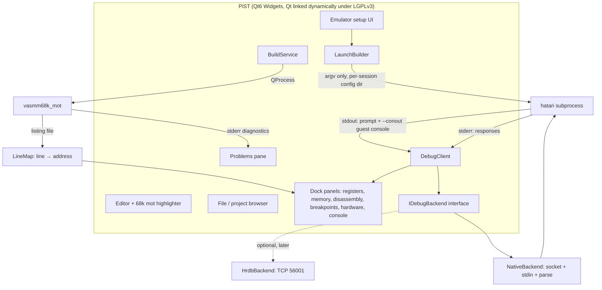

# PiST — an IDE for Atari ST assembly development

Cross-platform (Linux, Windows, macOS) Qt6 IDE for developing m68k assembly for the Atari ST/STE,
with an embedded Hatari emulator and integrated debugging.

**Status:** Phases 0–3 delivered (Falcon/DSP deferred, docs/FUTURE.md §3); Phase 4 substantially
complete — AppImage, deb, RPM, dmg, MSI and the plain archives all ship (see §7).
**Project licence:** GPL-2.0-or-later (see §10) — free software, contributions welcome.
**Baseline verified against:** Hatari 2.6.1 (Ubuntu build) + vasm 2.0f, on Linux x86-64.

---

## 1. Scope

| In scope | Out of scope (for now) |
|---|---|
| vasm m68k (Motorola syntax) assembler integration | C/C++ toolchain (m68k-atari-mint, vlink multi-module) |
| Embedded Hatari, driven as a subprocess | Falcon DSP *source-level* debugging |
| Editor with 68k assembly syntax highlighting | Cycle-accurate profiling tooling |
| File/project browser (hard drive + Disk A/B) | IPF/Pasti floppy authoring |
| Emulator setup UI (machine, TOS, RAM, monitor, drives) | |
| Build diagnostics in a Problems pane | |
| Breakpoints, stepping, disassembly, registers, memory, hardware views | |
| Source-line mapping (PC ↔ file:line) | |

**Guiding constraint:** the IDE sets emulator state through **command-line arguments**, never by
writing or mutating `hatari.cfg`.

---

## 2. Verified baseline

Everything below was observed by execution or read directly from source during design. See §9 for
the full ledger of what remains unverified.

### 2.1 Toolchain present

```
hatari           /usr/bin/hatari            Hatari v2.6.1 (Feb 2026 build), linked against libreadline
vasmm68k_mot     /usr/local/bin/vasmm68k_mot  vasm 2.0f
gst2ascii        /usr/bin/gst2ascii           DRI/GST → ASCII symbol converter
TOS ROMs         /usr/share/hatari/TOS*.img   supplied by the distro package
```

### 2.2 vasm behaviour

| Behaviour | Observed |
|---|---|
| Assemble | `vasmm68k_mot -quiet -Ftos -o prog.prg src.s` → exit 0 |
| Banner / section sizes | **stdout** (suppressed by `-quiet`) |
| Diagnostics | **stderr**, format `error <N> in line <L> of "<file>": <msg>`, followed by the offending source line prefixed with `>` |
| Columns | **not reported** — no column information |
| Exit code | `1` on error; output file is **deleted** |
| Listing | `-L <file>` → per-line `section:offset bytes … line#: source`, plus symbol tables by name and value |
| `-dwarf=3` + `-Ftos` (multi-section) | **fails**: `error 3004: section attributes <r> not supported` / `fatal error 3008`, exit 1 |
| `-dwarf=3` + `-Felf` | works, emits `.debug_{aranges,info,abbrev,ranges,line}` |
| `-linedebug` | **Amiga hunk output module only** — unusable for `.PRG` |
| Symbols | DRI/GST emitted by default; `-devpac` suppresses them; `-monst` retains |
| Not options | `-g`, `-l` do not exist (`-L` is the *listing* file) |

### 2.3 Hatari debug surfaces (upstream)

| Surface | Verdict |
|---|---|
| GDB stub / RSP | **Does not exist upstream.** No `gdb`/`remotedebug` path; no `--gdb` option |
| Native CLI debugger | Full command set: `a b d m w l r s n c find struct profile history symbols bt*` (CPU) and `da db dd dm dr dspsymbols dp` (DSP) |
| `--control-socket` | POSIX-only; `hatari-debug <cmd>` injects any debugger command; **responses are not returned on the socket** |
| `--cmd-fifo` | Same command set via FIFO; POSIX-only |
| `--parse <file>` | Deterministic command scripts at launch; resolves relative paths against the file's own directory |
| `--conout <0-7>` | Captures guest console output to host stdout |
| Watchpoints | **None.** `grep -rni watchpoint src/debug/` → 0 matches |

\* `bt`/`backtrace` exists on git `main`, **not** on 2.6.1.

### 2.4 Known 2.6.1 vs `main` drift

| Feature | 2.6.1 | `main` |
|---|---|---|
| Symbol autoload field | `bSymbolsAutoLoad` (bool), default **true** (`configuration.c:615`) | `nSymbolsAutoLoad`, default `SYM_AUTOLOAD_DEBUGGER` (`configuration.c:621`) |
| Autoload command | `symbols autoload on\|off` | `symbols autoload <exec\|debugger\|off>` |
| CLI equivalent | *none* | `--symload <mode>` |
| `bt` / backtrace | absent | present |
| `echo` in a `--parse` file | **aborts the emulator** — `assert(s2 < s1)` at `str.c:240` | fixed: `assert(s2 <= s1)` at `str.c:256` |
| Debugger transport | works | **truncated responses, four suite failures** — see below |
| ROM discovery | — | **the bundled ROM was invisible** — see below |

**Bundling exposed a ROM-discovery bug that was already there.** Every release
archive shipped its EmuTOS ROM in `share/emutos`, and `tosSearchPaths()` never
searched there — the string did not appear in the file. So on any machine without
the `hatari` package the bundled ROM was invisible and Run/debug were dead on
first launch. It survived because the release verification set `PIST_TOS_DIR`,
which short-circuits the discovery logic being tested. The fix walks up from the
executable for `share/emutos` and `share/hatari`, and the walk is exposed as
`paths::bundledDataSearchPaths()` so a test can drive it. The AppImage verification
now runs with `PIST_TOS_DIR` pointedly unset.

**Bundling is also where two packaging faults were caught:**

- Naming only `pist` with linuxdeploy's `-e` meant the bundled Hatari arrived
  without SDL2, libreadline or libpng and could not start. Both executables are
  named now.
- The reverse mistake — force-copying every library `ldd` reports missing —
  copies glibc-coupled libraries from the build host. A `libtinfo` taken from a
  development machine demanded `GLIBC_2.42` on a 2.39 system. linuxdeploy's
  exclusion of the X11/Wayland/ALSA set is deliberate and correct, and it is left
  alone: every desktop has those, and testing in a headless container that lacks
  them proves less than it appears to.

**The suite does not work against Hatari 2.4.1**, which is what Ubuntu 24.04
packages. Register dumps come back as a single line with the `SR=` line missing,
so registers never become valid and every test that reads them fails. Ubuntu
22.04 ships 2.3.1, so no distribution package is a supported version: CI builds
**2.6.1 from a pinned source tarball** and tests that. This is the same
conclusion the release packaging reached for vasm, and the same one that argues
for bundling Hatari rather than relying on the user's copy.

The bundled Hatari is built **without readline**, as a licence constraint rather
than a preference: three files Hatari compiles in
(`src/cpu/uae/{attributes,types,vm}.h`) are GPL-2.0-only, so the conveyed binary
is GPLv2-capped and a GPLv3 library cannot join it (§10). The build action passes
`-DCMAKE_DISABLE_FIND_PACKAGE_Readline=ON`, which makes Hatari's own
`find_package(Readline)` report not-found without patching its source
(`CMakeLists.txt:133-136`); the debugger takes its `fgets` fallback
(`src/debug/debugui.c:937`) and writes the prompt to **stderr**, with no trailing
newline. That is the row §3.3 documents and the path macOS CI has always run
(§9), and PiST reads it either way: a command is framed on the `> ` prompt on
*either* stream (`src/emu/EmulatorHost.cpp:101-104`, applied at `:597`). So
nothing about the transport depends on readline — least of all for the bundled
fork, whose debugger hands its loop to the HRDB callback in `DebugUI()` and never
reaches `DebugUI_GetCommand()` at all; the stdin prompt belongs to the upstream
build CI also makes, whose native-transport suites exercise the stderr row.

The `echo` abort is triggered by any argument containing no backslash escape, because
`DebugUI_Echo` calls `Str_UnEscape` on every argument. **Never put `echo` in a bootstrap script.**

---

## 3. Architecture

### 3.1 Shape



### 3.2 Decisions and rationale

**Emulator is always a separate process.** Hatari's `readme.txt` states that linking it statically
*or dynamically* creates a combined work under the GPL. Keeping Hatari out-of-process is the only
approach that works on all three platforms today, and it keeps the GPL boundary explicit and
auditable — an important property for a project that asks others to contribute to it.

The project itself is GPL-2.0-or-later, so in-process linking would be permissible *provided* the
combined work is conveyed under GPLv2 — Hatari contains three GPL-2.0-**only** files that are
compiled in (audited in §10). Two things nonetheless keep it a subprocess:

1. **Platform capability.** macOS cannot reparent a foreign process window (`WId` is a process-local
   `NSView*`), and embedding via libretro's flat C ABI means reimplementing video, input, and audio
   plumbing that Hatari's SDL frontend already provides.
2. **Maintenance surface.** The transport is text-based and version-gated (§3.3), which is far
   cheaper to keep working against an upstream we do not control than a compiled-in dependency that
   must be rebuilt and re-audited on every release.

In-process libretro remains possible for macOS later — the `libretro/hatari` core is a fork of
exactly the tree audited in §10, so the same GPLv2 conveyance condition applies.

**The bundled emulator is the hrdb-main fork** (upstream 2.6.1 plus the remote-debug listener).
The full debug loop also works on stock Hatari via the native backend; the fork adds typed
framing, pause-while-running, and a Windows-capable control path. The fork is bundled
unmodified from a checksum-pinned commit and driven as a subprocess, so the licence boundary
is unchanged (§10). A user-supplied stock Hatari still works — the probe selects the native
backend for it.

**Loopback TCP is a Phase-3 option, not a Phase-0 requirement.** HRDB (`tattlemuss/hatari`,
branch `hrdb-main`, TCP 56001, protocol `0x100a`) provides typed request/response framing, full
conditional breakpoints, DSP registers, and hardware register reads — and works on Windows, unlike
`--control-socket`. GDB (the `dgis/hatari` fork, TCP 2345) is the only path with memory watchpoints
(`Z2-Z4`), but is m68k-only, has no DSP, no `qSymbol`/DWARF, and silently downgrades watchpoints in
some paths.

**Backends are complementary, not ranked:**

| Capability | Native (upstream) | GDB stub (dgis fork) | HRDB (tattlemuss fork) |
|---|---|---|---|
| Register read/write | yes | yes (no USP/ISP) | yes |
| Memory read/write | yes | yes | yes |
| Conditional breakpoints | yes, full expression language | address-only | yes, full expression language |
| Memory watchpoints | **no** | yes (`Z2-Z4`) | no |
| Single-step / step-over | yes | step only (step-over is client-side) | no step-over frame (client-synthesised) |
| DSP registers / breakpoints | **yes** | no | yes |
| Typed framing | no | RSP | yes |
| Platforms | POSIX socket; stdio everywhere | TCP | TCP |

**Embedding strategy per platform:**

| Platform | Approach | Limitation |
|---|---|---|
| X11 | `PARENT_WIN_ID` — Hatari reparents its own SDL window (`src/sdl/screen.c:219`) | X11 only |
| Wayland | force `QT_QPA_PLATFORM=xcb` + `SDL_VIDEODRIVER=x11`, run under XWayland | depends on XWayland |
| Windows | `SetParent` on the Hatari HWND | input-queue/focus quirks |
| macOS | **cannot** reparent a foreign process window (`WId` is a process-local `NSView*`) | detached window, or in-process core |

**A detached emulator window mode ships from day one.** It removes the entire embedding risk class
at no cost, and is the only option on macOS initially.

### 3.3 Debug transport

The native backend uses three asymmetric channels. This is the highest-risk area of the project.

```mermaid
sequenceDiagram
  participant IDE
  participant H as Hatari
  participant E as Editor

  IDE->>H: spawn: --parse boot.ini <builddir>/prog.prg
  Note over H: boot.ini arms: b pc = TEXT && pc < $e00000 :once
  H-->>IDE: stderr "You have entered debug mode."
  Note over H: debugger enters AT PROGRAM START, prints session dump
  H-->>IDE: stdout "> " prompt  (marks entry dump complete)
  IDE->>H: stdin: symbols prg
  H-->>IDE: stderr "Loaded N symbols" + stdout "> "
  IDE->>H: stdin: b pc = $ADDR
  IDE->>H: stdin: c
  Note over H: emulation runs; ONLY NOW is the socket serviced
  H-->>IDE: stderr breakpoint hit, PC dump
  IDE->>E: highlight line for PC (via LineMap)
  IDE->>H: stdin: s / n
  H-->>IDE: stderr new PC + disassembly
```

Note that every debugger command — symbols, breakpoints, stepping — goes over **stdin**, because the
socket is not serviced while the debugger is stopped.

| Channel | Direction | Carries | Notes |
|---|---|---|---|
| stdin | IDE → Hatari | **All debugger commands.** The only channel that works while the debugger is stopped | The debugger blocks in `DebugUI_GetCommand` reading stdin |
| `--control-socket` | IDE → Hatari | `hatari-stop` / `hatari-cont`, `hatari-option`, `hatari-event`; debugger commands **only while emulation is running** | **Hatari is the client**: it calls `connect()` (`control.c:588`) and never binds, so the IDE must already be listening. Returns almost nothing |
| stderr | Hatari → IDE | Command output, debugger output, Hatari log lines | Mixed; responses are delimited by the prompt/echo markers below |
| stdout | Hatari → IDE | The debugger prompt (readline builds), `--conout` guest console | |
| `logfile <f>` | Hatari → file | Registers, memory, disassembly dumps only | Avoids mixing bulk output with logs |

**The control socket is starved while stopped.** `Control_CheckUpdates()` has exactly one call site —
`src/sdl/gui_event.c:134`, the SDL event pump — and none under `src/debug/`. When the debugger is
waiting for input, nothing services the socket, so `hatari-debug` commands sent while stopped are
never read. Verified: with the debugger stopped at entry, a socket `hatari-debug e TEXT` produced
**zero bytes** on stderr, while the same command over stdin worked immediately; resuming emulation
made the socket deliver again.

Consequence: the split is **not** "socket = commands, stdin = stepping". It is
**stdin = everything while stopped**, socket = control commands while running. This also means the
`--control-socket` POSIX-only limitation is a far smaller problem than it first appears: Windows
loses only `hatari-stop`/`hatari-option`-style control, not debugging.

**Command completion is framed by the debugger prompt, not by content.** The debugger writes `> `
before each blocking read, and cannot print the next prompt until the current command has finished
executing, so a prompt is a true end-of-command signal. Which stream carries it is build-dependent:

| Build | Prompt | Command echo |
|---|---|---|
| readline linked (`HAVE_LIBREADLINE`) | `readline("> ")` → **stdout** | readline echoes to stdout |
| no readline (the `fgets` fallback) | `fprintf(stderr, "> ")` → **stderr** | **none** |

The property is the *build*, not the platform. Linux and macOS CI both run the stderr row since the
bundled build pins `CMAKE_DISABLE_FIND_PACKAGE_Readline=ON` (§2.4 — a licence constraint); macOS
would anyway, because Hatari's `rl_filename_completion_function` link probe fails against
Homebrew's readline. The bundled Windows emulator is the HRDB fork, whose stdin
prompt framing is never used at all. Both streams are therefore counted, stderr being recognised by
a trailing `> ` with no newline — which cannot be confused with the `> <cmd>` echoes that
`DebugUI_ParseLine` and `DebugUI_ParseFile` write to stderr, since those always end in a newline.

Two further framing requirements, both found by test failures:

- **Consume the entry dump before dispatching.** After announcing entry the debugger prints its
  session dump (autoloaded symbols, `info` output, registers). Dispatching the first command
  immediately attributes that dump to it; the queue must wait for the entry prompt.
- **Account for owed prompts.** A command that times out (step-over can legitimately block until its
  internal breakpoint hits) is still executing; its late prompt must be swallowed, or it completes
  the *next* command with the previous command's output.

**`echo <nonce>` framing is unnecessary** — and unusable, since `echo` aborts 2.6.1 (§2.4).

**Implementation:** use `QLocalServer`/`QLocalSocket` (`Qt6::Network`, already part of qtbase) rather
than raw POSIX sockets. On Unix these are `AF_UNIX`/`SOCK_STREAM`, exactly matching Hatari's
`socket(AF_UNIX, SOCK_STREAM, 0)` + `connect()`, and they are event-loop driven — no blocking
`accept()` on a GUI thread. Three details:

- Pass the **absolute** socket path to `listen()`; Qt uses it verbatim on Unix, so it is
  byte-identical to the argument given to `--control-socket`.
- Call `QLocalServer::removeServer(path)` before `listen()`, otherwise a socket file left by a
  crashed session causes the bind to fail.
- Keep the path short — `sockaddr_un::sun_path` is limited (108 bytes on Linux), so a per-session
  temp directory must not nest deeply.

---

## 4. Assembler integration

### 4.1 Build

```
vasmm68k_mot -quiet -Ftos -I<incdirs> -D<defines> -L <listing> -o <out.prg> <source.s>
```

Diagnostics parsing (stderr):

```
error 10 in line 2 of "bad.s": number or identifier expected
>	move.l	#0,	d1
```

- Primary regex: `^(error|warning|fatal error) (\d+) in line (\d+) of "([^"]+)": (.*)$`
- **Fallback regex** for line-less diagnostics produced by module-level and fatal failures:
  `^(error|fatal error) (\d+): (.*)$` — file and line are unknown, so these attach to the build log
  rather than a specific editor line. Both forms are real:

  ```
  error 10 in line 2 of "bad.s": number or identifier expected
  error 3004: section attributes <r> not supported
  fatal error 3008: output module doesn't allow multiple sections of the same type ()
  ```
- The next line beginning with `>` is the source excerpt — used to place the caret.
- No column data exists; map by line only, and refine using the listing's per-line byte offsets.
- Output file is deleted on error; the build service must not assume a stale `.PRG` exists.

### 4.3 Separate compilation (vlink)

Multi-file projects are assembled one module at a time and linked, because
`vasm -Ftos` can only produce a program from a single file:

```
vasmm68k_mot -quiet -Fvobj -I<dirs> -L <mod>.lst -o <mod>.o <mod>.s     # per module
vlink -b ataritos -M<prog>.map -o <prog>.prg <mod>.o ...                 # then link
```

The **entry module must be listed first**: TOS begins executing at the start of
text, so the module containing the entry point has to come first in the link.

Verified end to end: the linked `.PRG` carries a DRI/GST symbol table that
`gst2ascii` and Hatari's `symbols prg` both read, so breakpoints and disassembly
labels keep working across modules with no new debug plumbing.

Two consequences for the line map, both of which broke the single-module
assumption (§4.2):

- **Each module restarts its offsets at zero.** One listing's offsets can no
  longer be added to a single live base; every module needs its own.
- **The linker's map supplies those bases.** `vlink -M` reports each module's
  address range within the merged output section, and `-lineoffsets` is *not* an
  alternative — vobj and DRI objects carry no line data, so it comes out empty.

So `ProgramLineMap` composes one `LineMap` per module and derives each module's
base from the live section address plus its map offset. A single-file build needs
no linker and no map, and is the same code path with one module at offset zero.

Two further facts that only appear once linking is attempted:

- **The section name depends on the output format.** `-Ftos` writes `"text"`,
  `"data"`, `"bss"`; `-Fvobj` writes `"CODE"`, `"DATA"`, `"BSS"`. A lookup that
  accepts one spelling silently resolves nothing for the other.
- **vasm's `(start-end)` is exclusive**: a 0xC-byte section reads `(0-C)` and its
  last byte is at 0xB. Treating it as inclusive makes every span a byte too long,
  so a section can claim an address belonging to the next one — which is how two
  modules in a linked program both matched the same PC.

### 4.2 Line mapping (PC ↔ source line)

Derived from the `-L` listing, **not** from DWARF. The listing contains, for each source line:

```
00:00000008 702A            	     4: start:	move.l	#42,d0
00:0000000A 4E75            	     5: 	rts
01:00000000 6869            	     8: msg_ptr:	dc.b	"hi",0
```

with `Sections:` declaring `00: "text"`, `01: "data"`, `02: "bss"`.

Mapping:

- **line → address:** `section_offset` + (live basepage section address)
- **address → line:** binary search over the flattened map

Live section addresses come from `info basepage` (`TPA start`, `Text/Data/BSS segment`). At the
first debugger stop, `Text segment` equals the program's load address.

This keeps `-Ftos` single-file builds working with zero DWARF, zero GDB, and no fork. DWARF only
becomes relevant for future mixed C/asm interop; multi-module builds should use vlink's map file.

**Verified exact:** listing `loop` at `00:0000000C` → live `0x0125a2` = TEXT `0x012596` + `0x0C`.

---

## 5. Launcher rules (hard-won, non-obvious)

These are the operational constraints the launch builder must encode.

1. **Exactly one positional argument, and it must be the `.PRG`.** This is the only invocation that
   both mounts the GEMDOS HD *and* autostarts the program:
   `Opt_HandleArgument` detects an Atari program, calls `INF_SetAutoStart()`, sets
   `szHardDiskDirectories[0]` to the program's directory, and sets `bBootFromHardDisk`.
   Two positionals produce `Unrecognized option`.
   The directory split is `strrchr(path, PATHSEP)`. On Windows `PATHSEP` is `\`, and a Qt
   path (`C:/proj/hello.prg`) contains none, so Hatari mounts the process working directory
   and autostarts a program named with the entire Windows path — TOS cannot find it, and the
   project directory is not the GEMDOS drive. `SessionConfig::toArgv()` therefore passes host
   paths with native separators (a no-op elsewhere). Verified against Hatari 2.6.1
   `src/options.c` `Opt_HandleArgument`.
2. **`--gemdos-drive` takes a drive letter only** (`C`–`Z`, or `skip`). The host directory comes
   from the positional argument. Never pass a directory to it.
3. **Autostart requires TOS ≥ 1.04.** Autostart is implemented via `C:\EMUDESK.INF`, and
   `inffile.c:1042` bails for `TosVersion < 0x0104` with
   *"Only TOS versions >= 1.04 support autostarting & resolution overriding!"*.
   On TOS 1.00/1.02 the run silently no-ops: no Pexec, no `CurrentProgramPath`, no autoloaded
   symbols, and the entry breakpoint never fires — the session simply appears to hang.
   Because ROM filenames are arbitrary for user-supplied images, the version must be read from the
   **image header**, not the name: `TOS_LoadImage` reads it as a big-endian 16-bit value at offset 2
   (`src/tos.c:1027`). Two refinements matter when predicting Hatari's behaviour:
   - a filename is **not evidence**; Hatari never reads names, so a version inferred from one must
     not authorise the autostart path. Only a header-derived version may.
   - version bytes are displayed in **hex**, matching Hatari's own `%x.%02x` (`src/tos.c:874`), so
     the field `0x0162` is TOS **1.62**, not 1.98. The filename convention follows the same rule
     ("TOS v1.62"), so a decimal parse silently produces `0x013E`.

   Hatari itself rejects GEMDOS HD entirely below 1.04 with
   *"Please use at least TOS v1.04 for the HD directory emulation"*, so this is a hard floor for the
   whole GEMDOS-HD run path, not just autostart.

   **Fallback implemented (2026-09):** a pre-1.04 ROM no longer refuses the run. The IDE writes a
   per-session 720 KiB FAT12 image (`src/build/FloppyImage.cpp`, geometry pinned against a real
   `mkfs.vfat` image) containing `AUTO/PROG.PRG` and boots it via `--disk-a` with no positional
   and no `-d`. Every TOS version executes `AUTO/*.PRG` from the boot floppy, so this works where
   GEMDOS HD cannot. Two transport details differ on this path:
   - `--debug` must accompany `--debug-except`: the `autostart` deferral arms the exception mask
     only on INF load (`src/inffile.c`), and a floppy boot has no virtual INF, so without the
     startup toggle the mask stays zero and faulting programs never break in. Verified on TOS
     1.02: an illegal instruction breaks in with `Debugger: *CPU exception*`.
   - The load address differs (the program lands low, at 0xCC04 on a 1 MiB ST rather than the
     0x12596 seen under GEMDOS HD), which is exactly why breakpoints stay file:line and resolve
     only after `info basepage`.

   **Machine type and ROM are coupled, and Hatari enforces the pairing by overriding `--machine`.**
   Verified matrix (TOS version × requested machine):

   | ROM | `--machine st` | `--machine ste` |
   |---|---|---|
   | 1.02 | accepted, but no autostart (WARN) | *"TOS versions <= 1.4 work only in"* → **switches to ST** |
   | 1.04 | accepted | *"TOS versions <= 1.4 work only in"* → **switches to ST** |
   | 1.06 | *"TOS versions 1.06 and 1.62 are for Atari STE only"* → **switches to STE** | accepted |
   | 1.62 | same → **switches to STE** | accepted |

   Note that **both 1.06 and 1.62 are STe ROMs** — 1.62 is the later release and fixes a
   number of bugs, so it is the better default when both are present. An STe cannot run an
   ST-only ROM (1.00–1.04) at all, which is why ROM selection is machine-aware rather than
   "first usable file in the directory".

   Two consequences for the setup UI, which must not be two independent dropdowns:
   - a machine/ROM pair can be **invalid**, and Hatari resolves it by silently overriding the
     requested machine (logging an `ERROR` line the IDE should surface);
   - the effective machine may therefore differ from the requested one, so the UI must reflect what
     was actually selected. A user who picks STE for DMA sound or the extended palette, with a 1.04
     ROM, silently gets an ST and their code fails in confusing ways. Three outcomes must be distinguished, never
   collapsed:
   - **known too old** → refuse, naming the version read from the header;
   - **known good** → proceed;
   - **unknown** → warn and ask. Refusing outright would be wrong for a valid ROM whose header is
     unreadable, and proceeding silently reproduces the hang this rule exists to prevent.
4. **Never write `<prg>.sym` next to the `.PRG`.** A sidecar wins over the PRG's own DRI/GST table
   (`symbols.c:922-928`, `1032-1038`) and, because it is loaded with no base offset for code
   symbols, **stale content silently yields wrong addresses**. Put generated symbols in a
   per-session temp directory keyed by build hash.
5. **Prefer `symbols prg` over sidecars.** It re-reads the PRG's DRI table and relocates against the
   live basepage, so it cannot go stale.
6. **Two-phase attach.** Symbol names are unavailable until a table is loaded, so:
   arm `b pc = TEXT && pc < $e00000 :once` at launch (uses the `TEXT` *variable*, needs no symbols)
   → stop → `symbols prg` → only then use names in conditions, disassembly, and memory commands.
7. **Per-session config isolation.** Hatari always loads the user's `hatari.cfg` (only the *global*
   `/etc` file is skipped, and only under `HATARI_TEST`); CLI options are parsed afterwards and
   override it. Point `HOME`/`XDG_CONFIG_HOME` at a temp directory per session so leftover user
   settings (machine, monitor, joysticks, printer) cannot leak in.
8. **Reset-requiring settings are applied by relaunch, not live.** `hatari-option` runs the full CLI
   parser at runtime, but a change needing a cold reset raises a modal `DlgAlert_Query()` inside the
   embedded window — which will hang a headless IDE. Launch with `--alert-level fatal` and
   `--confirm-quit off`, and relaunch the process for machine/RAM/monitor/TOS changes.
9. **Version-gate the bootstrap script.** 2.6.1 has only the boolean form, so the script writes
   `symbols autoload on`; `main` added three modes and the script writes `symbols autoload
   debugger`. (`--symload <mode>` is `main`'s CLI equivalent, and the parse file is how this IDE
   applies the rule — `SessionConfig::toArgv()` never passes it.) Capability-probe at startup
   rather than assuming.
10. **The IDE is the socket *server*.** Hatari calls `connect()` (`src/control.c:588`) and never
    binds. Listen on the socket path **before** spawning Hatari, or Hatari exits immediately with
    `connection to control socket failed`. Use `QLocalServer`/`QLocalSocket` (see §3.3), call
    `removeServer()` first to clear a stale path, and keep the path under the `sun_path` limit.
11. **Accept both disassembler output formats.** Which engine produces the disassembly is a *user
    configuration* setting, not a build property: `bDisasmUAE` defaults to `true`
    (`configuration.c:624`), giving `00012596 7001   moveq #$01,d0`, while `false` selects Capstone,
    giving `$00012596 7001   moveq #$01,d0`. Because the IDE always runs with an isolated config
    directory (§5 rule 7) it consistently sees the *default* engine — so a parser tuned against a
    developer's own `~/.config/hatari/hatari.cfg` will differ from what the IDE actually receives.
    Treat the `$` as optional. The same applies to other engine-dependent output.
12. **Never pass `--control-socket` unconditionally.** It is declared inside
    `#if HAVE_UNIX_DOMAIN_SOCKETS` (`options.c:551`), so on Windows the option does not exist and
    Hatari exits with `Unrecognized option` — a startup failure that reads like a crash. Gate it on
    the capability probe, and treat an absent socket as normal: all debugger commands travel over
    stdin (§3.3), and the socket is currently unused by the IDE. `--debug-except` and `--parse` are
    *not* gated and are safe everywhere, which is what makes a socket-free session viable.
13. **Do not arm the `bus` exception.** `--debug-except autostart,bus` makes TOS raise a bus error
    at `0xfc0ee2` (inside the ROM) during startup, so the debugger breaks in before the program is
    executed — which also leaves `symbols prg` with no program to load. `autostart,illegal,address`
    and `zerodiv` were each verified to leave a healthy program running untouched. `linea`/`linef`
    are excluded too: they are normal parts of graphics calls.
    Note the `autostart` entry is not an exception class but a *deferral*: it arms the mask at INF
    load (`event.c`) rather than at startup, which is what keeps boot-time faults from breaking in.

### 5.1 Bootstrap parse file

Generated per session into the temp config dir (`EmulatorHost::writeBootstrapScript()`):

```
symbols autoload debugger        # `symbols autoload on` on 2.6.1
history cpu
b pc = TEXT && pc < $e00000 :once
```

The autoload line is the version-gated one (rule 9); `history cpu` starts the recording the
PC-history view reads; the entry breakpoint uses the `TEXT` *variable* so it needs no symbols.
(No `echo`, per §2.4. Relative paths inside a parse file resolve to that file's directory.)

### 5.2 Session argv (template)

```
hatari \
  --tos <rom> --machine <st|megast|ste|megaste|tt|falcon> \
  --memsize <n> --monitor <mono|rgb|vga|tv> --tos-res <res> \
  --ide-master  --acsi <id>= \
  --fast-forward yes --sound off \
  --alert-level fatal --confirm-quit off \
  --control-socket <sock> --parse <boot.ini> \
  <builddir>/prog.prg
```

---

## 6. Phases

### Phase 0 — spike (no fork; de-risks the debug loop)

Deliverables:
- CMake + Qt6 Widgets application shell
- Editor with m68k Motorola-syntax highlighter
- `BuildService` invoking `vasmm68k_mot`, parsing stderr diagnostics into a Problems pane
- `LaunchBuilder` producing the argv above with a per-session config dir
- `DebugClient` implementing: bootstrap parse file, control-socket one-shot commands, stdin
  stepping loop, stderr response parsing
- Dock panels: registers, disassembly, memory

**Acceptance:** F5 assembles; a deliberately introduced syntax error appears on the correct line;
the program is launched and stops at its entry point; `symbols prg` relocates; registers and the
current source line update as `s`/`n`/`c` are issued.

*Prerequisite:* `qt6-base-dev` (Qt6 is not currently installed on the development machine).

### Phase 1 — IDE skeleton and setup UI

- Project/workspace model, file browser, settings persistence
- Emulator setup dialog emitting **CLI arguments only**: machine type, monitor, RAM, TOS ROM,
  hard disk images, floppy images, fast-forward, sound
- ROM import with SHA-256 known-good table (Hatari itself only sanity-checks size, version, and
  address in `TOS_LoadImage`, and explicitly skips the ROM's own checksum test)
- EmuTOS shipped as the default ROM, with the GPLv2 source offer
- Toolchain discovery for `vasmm68k_mot`
- Run-path selection paired with the ROM choice (see §5, rule 3)

**Acceptance:** a user can create a project, choose a machine and ROM, build, run, and quit, with no
writes to any real `hatari.cfg`.

**Status: complete.** Delivered as:

- `ProjectSettings` persisted to a `.pistproject` JSON file beside the source, auto-discovered on
  open, with recent paths in `QSettings`. Never touches `hatari.cfg` (§5 rule 7)
- `SettingsDialog` (Build and Emulator tabs): include paths, defines, CPU, extra assembler args;
  machine, TOS ROM, monitor, RAM, hard disk, floppy A/B, extra emulator args
- `Machine` models the machine/ROM pairing, so a project cannot silently be handed a ROM Hatari
  will reject, and ROM selection prefers the newest compatible version
- File browser and dirty-tracking with save prompts
- Session directories are cleaned up rather than accumulating one per run

Deliberately deferred: a ROM SHA-256 known-good table and EmuTOS shipping (§7 packaging), and
multi-file/vlink builds. Floppy *listing* and *export* of 720 KiB `.st` / `.msa` images is
implemented in the project-files pane, as are in-place edits (the copy/move paths rewrite an
image with `floppy::updateImage`; `.dim`/`.ipf` targets are refused). IPF/Pasti authoring is not.

### Phase 2 — full debug UI on the native backend

- Breakpoints: address and full conditional expressions, gutter-integrated
- Source-line breakpoints via the `-L` line map
- Registers, two hex memory panes, disassembly with symbol labels, PC history, debug console
- DSP panels (registers, memory, breakpoints) for Falcon targets
- `IDebugBackend` interface with `NativeBackend` as the sole implementation

**Acceptance:** a conditional breakpoint set from the UI fires; a register can be edited; stepping
follows the source line; step-over correctly clears a subroutine.

**Status: complete for ST/STE; Falcon deferred.** Delivered on `EmulatorHost` driving stock
Hatari over the three-channel transport (§3.3): gutter breakpoints with editable conditions
(ANDed with the PC test — the only watchpoint mechanism upstream, also surfaced separately as
`Watchpoint`), source-line breakpoints resolved through `ProgramLineMap`, editable registers,
tagged multi-pane memory views, symbol-labelled disassembly, PC history, and stack and hardware
panels. Two items are deliberately not done:

- **DSP panels (Falcon).** Deferred — Falcon is out of scope for now; see `docs/FUTURE.md` §3.
  The "debug console" ships as an interactive entry line on the build/debug console dock; it is
  also the natural first surface for DSP commands when Falcon support lands.
- **`IDebugBackend` interface.** Delivered with Phase 3, when a second implementation existed
  to justify it.

### Phase 3 — optional backends

- `HrdbBackend` over TCP for hardware register reads
- A portable control channel for Windows (see `docs/FUTURE.md`)
- GDB-stub backend for memory watchpoints
- In-process libretro core for macOS integration (permitted under GPL-2.0-or-later combined with
  Hatari; see §10)

None of Phase 3 changes the UI if `IDebugBackend` is designed correctly.

**Status: `IDebugBackend` and `HrdbBackend` delivered; the rest assessed below.**

Delivered:

- `emu/DebugBackend.h` — the `IDebugBackend` interface, extracted from `EmulatorHost`'s
  existing public surface (nothing speculative), plus `pause()`. `EmulatorHost` (native) and
  `HrdbBackend` both implement it; MainWindow holds the interface and swaps backends at launch
  when the project's `debugBackend` setting requires it (default `auto`: the probe decides).
- `emu/HrdbBackend` — the HRDB protocol (TCP 56001, 0x100a) end to end: entry stop via the
  bootstrap parse file (airtight; a socket-armed entry bp races TOS boot), registers and live
  TEXT/DATA/BSS bases from typed `regs`, memory dumps (uuencoded payload, rendered as upstream
  `m` text so the views parse it unchanged), breakpoints/watchpoints (`bp` takes the same
  BreakCond expressions), step, client-synthesized step-over, pause-while-running, and text
  commands via `console` with the response captured from the process's stderr (the fork flushes
  before its OK). Verified live by `tst_hrdb` (gated on `$PIST_HRDB_HATARI`, which CI provides)
  and by the `tst_gui` transport-swap and auto-probe cases.
- `pause()` also works on the **native** backend: `hatari-debug b pc ! 0 :once` over the
  control socket enters the debugger at the next instruction (`hatari-stop` alone would only
  halt the VBL loop — no prompt, wedged session). Pinned by
  `tst_emulatorhost::pauseStopsARunningProgram`, which exposed a real transport race: when the
  2-byte stdout prompt outran the stderr entry banner, `m_awaitingEntryPrompt` went stale and
  swallowed the *next* stop's prompt. Fixed in `EmulatorHost::handleStderrLine`; this would
  eventually have bitten any fast second stop, not just pause.

**Selection cannot be probed by version or option** — the fork is version-identical and adds no
CLI option — so it is probed by binary *content* (the HRDB banner string,
`HatariCapabilities::hasHrdb`), and a per-project setting (`auto`/`native`/`hrdb`) overrides the
probe. A forced mismatch (native on the fork, HRDB on stock) is refused at launch with the
reason named — the fork's stdin debugger is dead once its listener binds, and stock Hatari has
no listener (§9).

**Boundary, updated:** the fork is the **bundled** emulator in the Linux AppImage and the Windows
archive, installed as `hatari` — one emulator per install; the probe selects HRDB for it
automatically. The licence
analysis is unchanged (GPL-2.0-or-later, built unmodified from a checksum-pinned source — the
pinned fork commit, which the NOTICE source offer names). The one structural constraint: port
56001 is fixed, so one HRDB session at a time per machine — the connect watchdog names it if
another client holds the port.

**Spike record** (protocol facts behind the delivered backend, §9 has the ledger entry). The
fork builds unmodified and round-trips live.

Remaining assessments:

- **GDB-stub backend** (`dgis/hatari`): not needed. Its one unique capability was memory
  watchpoints, delivered in Phase 2 via self-inequality conditional breakpoints on stock
  Hatari; HRDB covers the rest of its ground with typed framing and DSP support.
- **libretro in-process core for macOS**: unchanged — licence-compatible, deferred for macOS
  polish; see `docs/FUTURE.md` §4.
- **Windows control channel**: HRDB supersedes it for pause/live breakpoints (works over TCP
  everywhere). Live floppy insert/eject uses debugger `setopt` while stopped (stdin / HRDB
  `console`), so that path is not socket-bound. A *running* native session still needs
  `hatari-option` on the control socket; HRDB can `console setopt` while running. Other
  live `hatari-option` changes stay native-socket-only; the upstream-patch route in
  `docs/FUTURE.md` §1 stays for those.

### Phase 4 — packaging

**Status: substantially complete.** Delivered:

- `cmake --install` installs the binary, a desktop entry and icon (Linux), and the
  licence plus third-party notices
- `NOTICE` records each component's licence and the obligation it creates —
  notably Qt's LGPLv3 relink requirement, satisfied by dynamic linking
- `src/toolchain/Toolchain` locates vasm and Hatari in a defined order (explicit
  setting → beside the executable → per-user tools directory → `PATH`) and reports
  a missing tool with instructions, rather than falling back to a bare name that
  fails later as an opaque process-start error
- Project settings carry explicit paths for both tools, so a user-supplied vasm or
  a custom Hatari build works without touching the environment

- A **release workflow** producing self-contained archives per platform, each
  carrying PiST, a vasm compiled from the author's unmodified source (pinned by
  sha256), and EmuTOS 1.4 (GPLv2) as a working default ROM, plus the licence and
  notices. Qt is deployed with macdeployqt/windeployqt on macOS and Windows, and
  the **Linux AppImage and the Windows archive additionally bundle Hatari**,
  built from the pinned hrdb-main fork commit (upstream 2.6.1 plus the
  remote-debug listener) by the same action CI uses (see §2.4 for why no
  distribution package will do). The macOS archive still does not bundle it. No
  PiST source change was needed: tool discovery already looks beside the
  executable first, so the bundled copy is found on its own.
- **Verified end to end from a downloaded archive**: the shipped assembler builds
  a program, the shipped EmuTOS boots it, the program produces its output, and the
  debugger attaches with symbols loaded. Not a claim about the packaging — an
  observation of the artefact.
- **Every archive is verified before publication** by running its own binary with
  `--diagnose` and asserting the resolved assembler is *inside the archive* and
  byte-identical to what was packaged. A bundle that ships a binary it does not
  use is the failure this exists to catch, and it has already caught two real
  packaging defects.
- **Installers keep the bundle in a private prefix.** The deb and the rpm are
  staged from the AppDir the AppImage is built from, and three things in that
  tree are wrong in a distro package. All three shipped in 0.8.3, whose deb no
  user could install:
  - linuxdeploy copies the *build host's* copyright file for every library it
    bundles into `usr/share/doc/<package>/`. Inside an AppImage that is
    attribution; inside a `.deb` those are paths dpkg knows belong to
    `libglib2.0-0`, `libpulse0`, `libxcb-*` and forty more installed packages,
    and dpkg will not take a file away from another package — `dpkg -i` aborted
    with *trying to overwrite `/usr/share/doc/libglib2.0-0/copyright`*. The
    texts move to `usr/share/doc/pist/licenses/distro/` rather than being
    dropped: they are the terms of binaries the package really carries.
  - the bundle's libraries sat in `/usr/lib`, which ldconfig scans — and scans
    **before** `/usr/lib/x86_64-linux-gnu`: with two copies of one soname in the
    cache the `/usr/lib` one is listed first, and that is what `ld.so` resolves
    (measured here, not assumed). The package therefore installed itself as the
    system-wide provider of `libQt6Core.so.6`, `libglib-2.0.so.0`,
    `libdbus-1.so.3` and forty more, for every other application on the machine.
  - the AppImage machinery at the root (`AppRun`, `AppRun.wrapped`, `.DirIcon`,
    `apprun-hooks/` and the root-level `pist.desktop`/`pist.svg` symlinks) would
    be installed into `/`.

  So the installers stage `/usr/lib/pist/` — Debian's private-library
  convention, and a directory ldconfig does not recurse into — holding `bin/`,
  `lib/`, `plugins/` and the ROM, with only `pist` and `pist-mcp` symlinked into
  `/usr/bin` so the bundled Hatari, vasm and vlink cannot shadow a user's own.
  The desktop entry, icons, AppStream metadata and docs stay in their public
  places. The subtree moves *rigidly*, which is what keeps it working: the
  binary's `$ORIGIN/../lib` rpath and the `qt.conf` linuxdeploy wrote beside it
  (`Prefix = ../`, `Plugins = plugins`) both resolve inside the prefix unchanged,
  and `bundledDataSearchPaths()` finds the ROM two levels up. Verified by running
  the 0.8.3 artifact from the new layout under xvfb — assembler, linker, hrdb
  emulator and EmuTOS all resolved inside it — and by the negative control: a
  `Prefix` one level deeper aborts with *Could not find the Qt platform plugin
  "xcb"*, which is also why the release workflow runs the packaged binary under
  xvfb rather than offscreen (the offscreen plugin is not bundled).
- **What a package manager reports.** `CPACK_PACKAGE_NAME` is the *product* name
  — PiST, which is what the MSI product name, the NSIS/STGZ install directory
  and the dmg volume show — and `CPACK_PACKAGE_VENDOR` the author, Koala
  Software, which is the MSI Manufacturer and the RPM Vendor. The distro package
  names stay lowercase `pist` (`CPACK_DEBIAN_PACKAGE_NAME`,
  `CPACK_RPM_PACKAGE_NAME`): Debian policy requires it, CPackDeb lowercases
  whatever it is given anyway, and CPackRPM does not. Asset file names carry the
  version without the tag's `v` (`PiST-0.8.3-linux-amd64.deb`), because
  interpolating `github.ref_name` verbatim produced `pist-v0.8.3-…`, which a
  software centre truncates at the first dot and reports as a package called
  "pist-v0".
- **The macOS bundle identifier was empty.** `MacOSXBundleInfo.plist.in` writes
  `CFBundleIdentifier` from `MACOSX_BUNDLE_GUI_IDENTIFIER`, a property the
  project never set, so `pist.app` shipped with `<string></string>` there. It is
  now the same reverse-DNS name the AppStream component uses, and
  `MACOSX_BUNDLE_BUNDLE_NAME` supplies `CFBundleName` — what Finder shows under
  the icon and what the menu bar shows while the app runs, which was the target
  name, "pist". The bundle *directory* stays `pist.app`, because that path is
  what the packaging steps, the dmg assertions and the archive checks name; the
  macOS deploy step now asserts the plist rather than trusting the property.
- **The name, author and licence a software centre shows come from AppStream**,
  not from the control file:
  `packaging/io.github.idontwantyourspamthanks.pist.metainfo.xml`, installed to
  `/usr/share/metainfo/`. The component id is a reverse-DNS name while the menu
  entry stays `pist.desktop`, and `<launchable type="desktop-id">` is what joins
  the two. A flat `pist` id also works — it merges by identity — but appstreamcli
  then warns `cid-desktopapp-is-not-rdns` and *fails* validation, a trap for
  whoever adds a CI gate later; the launchable link has been supported since
  AppStream 0.10, well past the 0.15/0.16 on Ubuntu 22.04. The file name must
  equal the id. The developer is stated twice, `<developer>` for AppStream 1.0
  and `<developer_name>` for the 0.15/0.16 on Ubuntu 22.04, which cannot read
  the new tag, so the deprecation notice appstreamcli prints about the second
  one is intended and is the only thing left in a clean validation.

  The component must also carry an `<icon>` and `<categories>`, and 0.8.4's
  carried neither. A component without an icon has no icon at all — that is why
  Ubuntu's App Center listed the installed package with a blank space beside its
  name — and `appstreamcli validate` only runs its store-visibility checks,
  `app-categories-missing` among them, once an icon makes the component qualify,
  which is how the file validated clean while carrying neither. The icon is
  `<icon type="stock">pist</icon>`, exactly what `appstream-generator` records
  from a desktop entry's `Icon` key, and the categories mirror the entry's own.
  Verified against a live install: `appstreamcli search pist` then reports
  `Name: PiST` and `Icon: pist`, and the hicolor cache the dpkg trigger rebuilds
  contains `pist`.

  The licence is stated three ways: `project_license` in the metadata, a DEP-5
  `copyright` at `/usr/share/doc/pist/copyright` (`packaging/copyright`), and
  `CPACK_RESOURCE_FILE_LICENSE` pointed at the repository's `LICENSE` instead of
  CMake's `CPack.GenericLicense.txt` placeholder. That file's `Files:` patterns
  are layout-agnostic (`*/vasmm68k_mot`, `*/libQt6*`, …) because one file ships
  in packages with three different layouts: a pattern naming `usr/bin/vasmm68k_mot`
  stopped matching the moment the installers moved to the private prefix, which
  would have left the non-free assembler and linker claimed by the GPL-2+
  catch-all — the exact carve-out the file exists to make.

  The deb's description is a single multi-line string: several quoted arguments
  to `set()` make a CMake *list*, and the semicolons that join a list reached the
  0.8.3 control file as a literal "; " at the head of every continuation line.
- **An AppImage does not add itself to the application menu, and cannot.** That
  is by design: integration is done by AppImageLauncher or `appimaged`, or by
  installing the deb/rpm, which put the desktop entry, the icons and the
  metadata in their public places. What the AppImage carries for those tools is
  the embedded `pist.desktop`, its icon and — since `VERSION` is now exported to
  `appimagetool` — a version stamp and a versioned file name.
- **The window's desktop identity.** `setDesktopFileName()` is called before the
  application object exists, which is when Qt reads it: the name becomes the
  Wayland `app_id` and the D-Bus activation name. Under X11 nothing changes —
  measured with `xprop` on the 0.8.3 binary, WM_CLASS is already
  `"pist", "PiST"`, because Qt derives res_name from the executable name rather
  than from `setApplicationName("PiST")`. `StartupWMClass=pist` in the entry
  therefore states what was already true. On Wayland the app_id came from the
  application name and matched nothing, so the taskbar icon did not group with
  the menu entry — the part of "does not show up right on the desktop" that was
  ours to fix, as distinct from the AppImage not registering itself.

  It is set *conditionally*, on `QStandardPaths::locate(ApplicationsLocation, …)`
  finding `pist.desktop` or AppImageLauncher's `appimagekit_pist.desktop`. An
  unconditional call was measured to make the desktop portal fail to register the
  app ID on every build-tree and unintegrated-AppImage start
  (`qt.qpa.services: … Could not register app ID: App info not found for
  'pist.desktop'`) — a warning printed for a name nothing on that system can
  resolve, on the two run paths that are not an installed package. Where an entry
  is installed the registration succeeds and the app_id is the entry's.

Open: macOS only — that archive still documents where to get the emulator, and
PiST reports it clearly when absent. Installers ship: deb and RPM from the
Linux release job, dmg from the macOS job and MSI from the Windows job, each
verified in CI by installing or inspecting the package. The Windows vasm
(cross-built with mingw-w64, as in the release workflow) is exercised natively on
the Windows CI leg, so the shipping assembler is tested per-PR, not just at
release time.

What remains by design is not the absence of Hatari but the relationship to it — PiST
never patches it, never links it, and drives it purely through command-line
arguments as a separate process (see §10), so shipping a copy does not move the
licence boundary.

Delivered since: the **first-run setup flow** — a startup dialog offering the
checksum-pinned vasm source build and EmuTOS download, with the destination
directories now part of tool and ROM discovery (§7, "First run" row).

- Dynamic Qt linking (LGPLv3 relink obligation) — **dependency notices delivered**:
  `packaging/collect-notices.py` generates each archive's `licenses/` set and
  `THIRD-PARTY.txt` from the artifact's real contents, asserted in the release
  verification steps
- vasm **detect-and-use**, bundled only in the release artefacts (see §7)
- Installers per platform

---

## 7. Legal constraints

| Component | License | Can we ship it? | Boundary |
|---|---|---|---|
| **PiST** (this project) | GPL-2.0-or-later | — | Chosen for compatibility with the emulator ecosystem; see §10 |
| Hatari | GPL-2.0-or-later upstream, with an explicit statement that static **or dynamic** linking makes a combined work; the binary we convey is **GPLv2-capped** by three GPL-2.0-only files (§10) | Yes | **Separate process/binary**, bundled in the Linux AppImage and the Windows archive, built unmodified from a checksum-pinned tarball (the hrdb-main fork commit). Isolated in `IDebugBackend`'s implementations so the boundary stays auditable; see §10 |
| GNU Readline | GPL-3.0-or-later | **No — not redistributed** | The bundled Hatari is built without it (`-DCMAKE_DISABLE_FIND_PACKAGE_Readline=ON`): a GPLv3 library cannot join a v2-capped work, so no readline travels in any archive and no `THIRD-PARTY.txt` lists it. Functionally free — the debugger's `fgets` fallback prompts on stderr, which §2.4 frames; see §10 |
| libretro Hatari core | GPL-2.0-or-later (identical `readme.txt` blob to upstream) | Yes | Part of Hatari's tree; our build makes the standalone binary, not the core. Were it ever conveyed, `dlopen` does not escape the GPL |
| libretro API header | MIT-style, per-file | Yes | Preserve notice |
| **vasm / vbcc** | Non-free: "may be redistributed without modifications and used for non-commercial purposes" | **Yes — because PiST is free software** | **Redistribute unmodified only.** Never patch vasm. Ship its `readme.txt`/manual and mark it as third-party. Any commercial use still needs the author's written consent |
| Original Atari TOS ROMs | Proprietary | No | User-supplied; validate size/version; add our own hash check |
| EmuTOS | GPLv2 | Yes | Data file, not linked. GPLv2 text + source offer |
| Qt 6 | LGPL-3.0-only / GPL-2.0-only / GPL-3.0-only / commercial | Yes | **Dynamic linking** under LGPLv3 (deliver Qt source, relink ability, Installation Information). Qt's GPL-2.0-only option is also available to us, since PiST is GPL-2.0-or-later |
| SDL2 (only if embedding upstream Hatari) | zlib | Yes | Acknowledgement |
| Capstone | BSD-3-Clause | Yes | Attach `LICENSE.TXT` |

**Batteries-included is legally achievable.** Because PiST is free software, the redistribution
terms of every component permit bundling:

- **EmuTOS** — GPLv2, ships as the default ROM so the IDE works out of the box with no user setup.
- **vasm** — vasm's licence permits redistribution **unmodified** for non-commercial purposes, which
  covers a free IDE. This is the single biggest win of the open-source decision: the assembler can
  be bundled and pinned to a known-good version instead of relying on the user to install it. The
  constraint is that the bundled binary must be byte-for-byte upstream's, so **the IDE must never
  patch vasm**; behaviours we need are obtained by command-line flags only.
- **Hatari** — GPL-2.0-or-later upstream; the binary PiST conveys is GPLv2-capped, because three of
  the files it compiles in grant version 2 alone (§10). Bundled in the Linux AppImage and the Windows
  archive as a separate executable (mere aggregation): built unmodified from the checksum-pinned fork
  commit (upstream 2.6.1 plus the remote-debug listener), never patched, and built **without** GNU
  Readline — a GPLv3 library cannot join a v2-capped work, and the `fgets` fallback that replaces it
  costs the transport nothing (§2.4).

Two distribution rules follow from this:

1. **Never modify bundled third-party binaries.** The IDE drives vasm and Hatari entirely through
   command-line arguments, which is already a design requirement (§1).
2. **A user-supplied toolchain must still work.** Detection order: project-local override →
   user-configured path → bundled. This keeps the IDE usable with a different `vasmm68k_mot`, with
   a newer/patched Hatari, or for commercial use where bundling would not be permitted.

Bundling a Hatari binary does not change the boundary: the copies in the Linux AppImage and the
Windows archive are still launched as separate processes, with command-line arguments only, never
patched and never linked in.

### Toolchain acquisition

Where each component comes from, kept deliberately separate from the source tree:
| Context | vasm | Hatari |
|---|---|---|
| **git repository** | **Never committed.** Keeps the repo 100% free software and DFSG-clean, so distributions and contributors never have to strip a non-free binary | Not vendored; built from the checksum-pinned fork commit at packaging and CI time |
| **Release artifacts** (Linux AppImage + deb/RPM; Windows archive + MSI; macOS dmg + archive) | Bundled unmodified, with its `readme.txt`; non-commercial redistribution is expressly permitted | Bundled as a separate executable (mere aggregation) in the Linux AppImage and the Windows archive — and the bundled build is the **hrdb-main fork** (upstream 2.6.1 + the remote-debug listener), built unmodified from a checksum-pinned commit tarball (MSYS2 ucrt64 on Windows, runtime DLLs beside the exe); the probe selects HRDB for it automatically. The macOS archive leaves the emulator to the user (`brew install hatari` carries 2.6.1) |
| **Linux distro package** | Optional dependency; the distro's `vasm` package is used if present | Not usable as supplied: 22.04 ships 2.3.1 and 24.04 ships 2.4.1, below the 2.6.1 the IDE is verified against (§2.4) |
| **First run without a toolchain** | **Delivered** as the startup setup dialog (`ui/SetupDialog`): when the assembler is missing it fetches the author's pinned source tarball, verifies the sha256, builds it (`make CPU=m68k SYNTAX=mot`) and installs it into the per-user tools directory; when no ROM exists it fetches the pinned EmuTOS zip likewise into `paths::suggestedRomDir()`, which `tosSearchPaths()` now includes. The URL and checksum are shown before anything downloads — a *convenience*, never a silent download. The pins are those of ci.yml/release.yml, and tst_toolfetch pins the copies to each other | Reported with an install hint; the bundled archives need none. The unprompted startup prompt fires whenever *any* piece is missing — including the emulator, which is the only gap on the macOS archive — and a persisted dismissal (`setup/promptDismissed`) makes it show once rather than nag |

This yields one-click setup on Linux and Windows — and on macOS for everything but the emulator —
without placing non-free bytes in the repository, and without ever breaching vasm's no-modification
clause.

**The remaining vasm caveat:** its commercial exception is scoped to AmigaOS, so anyone shipping a
*commercial* product based on this IDE must supply their own `vasmm68k_mot` (or obtain the author's
consent). The bundled binary is therefore a convenience for free/non-commercial use, never a
load-bearing dependency — which the detection order above already guarantees.

---

## 8. Risk register

| Risk | Severity | Mitigation |
|---|---|---|
| Debug transport is three asymmetric channels with no framing | High | `logfile` + quiescence delimiting; capability probe; encapsulate entirely inside `IDebugBackend` |
| Text scraping breaks across Hatari versions | High | Version-gate parsers; probe at startup; pin a tested range |
| Response interleaving with Hatari `INFO`/`WARN` logs | Medium | Route bulk output through `logfile`; filter stderr by known prefixes |
| `echo` aborts the emulator on 2.6.1 | Medium | Never emit `echo` into script files |
| Stale symbol sidecar yields silently wrong addresses | High | Per-session temp dir keyed by build hash; prefer `symbols prg` |
| TOS < 1.04 silently has no autostart | Medium | Pair ROM choice with run-path selection; AUTO-folder or floppy fallback |
| Runtime option change raises a modal dialog and hangs a headless IDE | Medium | `--alert-level fatal`; relaunch for reset-requiring changes |
| User config leakage between sessions | Medium | Per-session `HOME`/`XDG_CONFIG_HOME` |
| macOS cannot embed a foreign window | Medium | Detached-window mode; in-process core as a later option |
| Wayland lacks foreign-window support | Low | XWayland via `QT_QPA_PLATFORM=xcb` |
| Embedded SDL GUI can save over the user's real `hatari.cfg` | Low | Isolated config dir makes this harmless |
| The bundled emulator is a Hatari fork (hrdb-main), which may lag upstream releases | Medium | The fork is upstream 2.6.1 plus one self-contained file (`remotedebug.c`), pinned by commit and checksum; CI builds and tests it every run. If it goes unmaintained, the native backend against stock Hatari remains the fallback, and rebasing the listener is a bounded job |

---

## 9. Verified vs unverified ledger

### Verified by execution

- vasm: build, exit codes, stderr diagnostic format, output deletion on error, `-L` listing
  contents, `-dwarf` + `-Ftos` failure, `-dwarf` + `-Felf` success
- `gst2ascii` output format and address convention
- Hatari: control-socket connection and `hatari-debug` one-shot commands
- **The control socket is starved while the debugger is stopped** (0 bytes returned), and works
  again once emulation resumes
- **The debugger prompt is a reliable end-of-command signal**, on stdout for readline builds
- `b pc = TEXT && pc < $e00000 :once` armed at launch stops at program entry
- `symbols prg` relocates onto the live basepage exactly (`start` == `Text segment`)
- Stepping: `r`, `s`, `n`, `d`, `c` all functional over stdin
- Disassembly annotated with symbol labels
- `info basepage` field layout
- `--conout 2` captures guest console output to stdout
- Autoload fires on debugger entry, and a `.sym` sidecar takes precedence over the PRG's DRI table
- `echo` in a `--parse` file aborts 2.6.1 (`assert(s2 < s1)`)
- **TOS 1.02 cannot use the GEMDOS-HD run path at all** — Hatari refuses it, so both autostart and
  symbol loading fail silently
- **TOS version bytes are hex**: the field `0x0162` is TOS 1.62 (verified against the four ROMs
  installed on the development machine, whose header values agree with their conventional names)
- **The `r` response does not contain a `CPU=` header**; the PC must be taken from the trailing
  instruction line
- **The "You have entered debug mode" banner prints exactly once per session** — it is a `static`
  initialised to non-NULL and set to NULL after its first print (`debugui.c:1309`). It therefore
  reports the first stop only, and *every subsequent breakpoint hit or exception is invisible in the
  output*. Successive debugger entries must be detected structurally instead: a prompt arriving while
  no command is in flight. Without this, breakpoints work in the emulator but the IDE never learns
  they were hit
- **stdin at EOF makes the debugger abandon its read loop and resume emulation.** With no further
  commands queued, a firing breakpoint therefore re-enters and immediately resumes in a hot loop
  (observed ~1.17M hits in 15s). The IDE must hold the pipe open, which also means an IDE-driven
  session never relies on EOF to end it
- A source-line breakpoint was verified end to end in a live session: resolved from the listing to
  an address, armed, fired, and its PC mapped back to the originating line
- **`--machine` is advisory, not authoritative**: Hatari overrides it to match the TOS ROM, both
  directions (see §5 rule 3). The requested machine can silently differ from the emulated one
- **Disassembly format follows the user's `bDisasmUAE` setting**, not the build
- **`--control-socket` is absent on Windows** (declared under `HAVE_UNIX_DOMAIN_SOCKETS`), and a full
  session runs without it: break at entry, registers, symbols and stepping were all verified with the
  socket path left empty
- **A faulting program breaks in with no breakpoint set**, via
  `--debug-except autostart,illegal` — verified stopping on the `illegal` instruction
- **Arming `bus` breaks in spuriously**: TOS raises a bus error at `0xfc0ee2` during startup, before
  the program is executed
- End-to-end in `PiST`: the whole `ctest` suite passes — every parser/unit binary, the
  ROM-identification cases, and the emulator-integration suites against a real Hatari. (Deliberately
  not counted here: the suite grows, and a pinned total only goes stale.)
- **The Git commit contract is index-based and refuses rather than repairs.** The ticked rows are
  staged with `git add`, then the index is committed with no pathspec (`git commit -F -`) — so a
  `git add -p` selection, or anything else staged outside PiST, is never rewritten. A path that is
  staged but unchecked, or a path in conflict, aborts the commit *before* `git add` runs and is
  named in the error ("… is staged but not checked"; "Cannot commit a conflicted path: …"). The
  seven unmerged porcelain pairs are one conflicted row, never committable. Pinned by `tst_git`
  (`stagedOutsideTheSelectionBlocksTheCommit`, `conflictedMergeIsOneRowAndIsNeverCommitted`, …).
- **The session prune is process-aware on both platforms, but only the POSIX branch runs here.**
  `paths::processIsRunning()` asks the kernel with `kill(pid, 0)` on Unix and with
  `OpenProcess`/`GetExitCodeProcess` on Windows; the Windows body is inside `#ifdef Q_OS_WIN`, so it
  is compiled and warning-checked by the Windows CI leg, not executed on this Linux machine. Its
  job is the safe direction: a live pid makes the prune skip a session directory.
- **`QSaveFile::commit()` on Qt 6.8.1 renames a truncated file over the destination when the flush
  inside it fails.** The payload is buffered, so `write()` reports success and the failure only
  surfaces at the flush `commit()` performs; 6.8.1 checks its own `writeError` there, which that
  flush path never sets, so it renames and returns true. Qt 6.10 checks the device error and returns
  false. Reproduced side by side under `RLIMIT_FSIZE=0`: 6.8.1 leaves the destination empty and
  reports success, 6.10 leaves it intact and reports failure. Consequence for the archives, which
  bundle 6.8.1: `settings::save` cannot delegate the guarantee to `commit()` — it flushes explicitly,
  checks `QFileDevice::error()`, and `cancelWriting()`s when either is wrong. Pinned by
  `TstSettings::saveFailureKeepsPreviousFile`, which fails on 6.8.1 without that check and passes on
  both. A development machine on a newer Qt is green either way, which is how 0.8.2 shipped it.
- **An owed prompt's tail can still be on its way, so the drain that swallows it needs a wider
  window than the completion path's.** `drainStderr()` waits 20 ms where a completing command has
  already flushed everything; a command the transport abandoned at its 10 s timeout is still running
  inside the emulator, and 20 ms lost that race on the macOS runner
  (`aTimedOutCommandsTailDoesNotContaminateTheNext` failed in CI while passing on Linux). The
  owed-prompt path now waits 200 ms — bounded, and off the critical path, since the command was
  reported failed ten seconds earlier. Narrowing it back makes the test fail deterministically, which
  is the margin the fake's 50 ms gap is written against.

- **HRDB (fork `tattlemuss/hatari` hrdb-main, built unmodified, driven live):**
  the listener is unconditional on TCP 56001; on connect it sends
  `!connected\x010x100A\x00` then `!config`/`!status`/`!symbols` notifications. Commands are
  ASCII terminated by `0x00`; replies are `0x01`-separated fields, `0x00`-terminated, and
  `OK…`/`NG <code>`; async `!`-prefixed notifications (`!status` carries running/stopped and
  PC) share the stream and must be demultiplexed by prefix. `regs` returns name/value pairs
  **including the live TEXT/DATA/BSS bases** (the `info basepage` equivalent, with no parsing
  of its text table); `mem <hex-addr> <hex-count>` (bare hex, no `$`/`0x`) returns the bytes
  **uuencoded** (4 printable chars per 3 bytes, so NUL never appears and the `0x00` framing is
  safe), zero-padded in the final group; `bp <expr>` goes to `BreakCond_Command`, so our
  `b pc = …` breakpoint planning — and the self-inequality watchpoints — port unchanged;
  `break` pauses a *running* emulation on every platform (serviced at the VBL); `step`/`run`
  work. `console <cmd>` runs any debugui command but returns only OK — its output goes to the
  process's stderr (debugOutput and the disassembler's TraceFile both default there), flushed
  before the OK, so the response is the stderr tail drained at the OK
- **The fork's stdin debugger is dead, whether or not a client is attached**:
  `RemoteDebug_Init` registers `RemoteDebug_BreakLoop` whenever the listener binds, and
  `DebugUI()` then routes every break through it instead of the console loop. The entry banner
  and symbol autoload still print, which made a no-client session *look* like stdin framing
  worked — but a typed `r` produced no dump, because stdin is never read. Consequence: the fork
  cannot serve the native transport, and a forced mismatch is refused at launch
- **A stdout prompt can outrun the stderr entry banner** (2 bytes vs a multi-KB dump; the pipes
  have no ordering): when it did, `m_awaitingEntryPrompt` was armed after its prompt had already
  been consumed, and the *next* stop's prompt was swallowed as "the entry prompt" — the session
  never reported stopped again. Found by the native pause test; fixed by not arming the flag
  when the banner arrives with `m_stopped` already set
- **Native pause works via the debugger, not the pause command**: `hatari-debug b pc ! 0 :once`
  over the control socket enters the debugger at the next instruction. `hatari-stop` only halts
  the VBL loop — no prompt ever arrives and the session wedges. BreakCond operators are the
  single characters `= ! < >` (no `<>` form)
- **The stderr-prompt dispatch watermark must move as the buffer is consumed.** On no-readline
  builds the prompt goes to stderr, and completion is a trailing `"> "` in the stderr buffer
  that grew past the size recorded at dispatch. (macOS CI hits this path: Hatari's CMake finds
  brew's GNU readline, but its `rl_filename_completion_function` link probe fails — seen in the
  configure log — so `HAVE_LIBREADLINE` stays off and the debugger uses the `fgets` fallback.)
  A dispatch issued
  *from a line handler* — the entry banner arming queued commands — ran mid-`processStderrData`,
  while the buffer still held un-consumed lines; the recorded offset then pointed past bytes the
  line loop was about to remove, no later trailing prompt ever compared as new, and every stop
  after the entry stop went undetected (MainWindow sessions read as running forever on macOS CI).
  Fixed by shifting the watermark down with each consumed line and consuming the prompt on fire,
  so later stderr noise cannot re-fire it. Same latent class as the stale-prompt race above:
  buffer offsets and pipe ordering are both unsafe to assume
- **The remote-control socket requires a per-session token.** `auth <token>` is the first line
  on every connection; anything else is refused and the connection dropped, and a command
  pipelined after a bad token in one burst (or sent during the disconnect window) never
  executes — the client stays in the pending set until it is gone. Port and token are published
  to `PiST/PiST/control-port` under the platform user-data directory, owner-only file and
  directory, which a flagless `pist-mcp` reads (verified live: raw connection refused, shim
  authenticates with no flags). `listen(0)` publishes nothing, so tests no longer overwrite a
  real IDE's file. All pinned in `tst_remotecontrol`

### Verified by CI (executed on real runners)

**Current status: Linux, macOS and Windows all build, pass every suite, and
install cleanly.** This is the first genuine cross-platform evidence in the
project; everything before it was either Linux-only or read from source.

- **gcc, clang and MSVC all compile the tree with no warnings**, and the test
  suites pass on each. The emulator suites run on Linux and macOS (both build
  the pinned 2.6.1 and the hrdb-main fork from source, both transports
  exercised). Windows runs them no longer: the official stock build is a
  GUI-subsystem binary that never reaches the debugger over pipes, and the
  MSYS2 ucrt64 fork build fails the same suites there too — so the Windows leg
  unit-tests only, and the Windows-bundled fork ships as experimental. The
  tests that need a capability a build lacks (the control socket on stock
  Windows Hatari) report as *skipped*, never as passed, so a green run does
  not overstate what was verified.
- **`cmake --install` works on all three**, and the installed binary starts from a
  staged prefix — which is what `CMAKE_INSTALL_RPATH_USE_LINK_PATH` provides. The
  release archives go further: macdeployqt/windeployqt/linuxdeploy make each
  bundle self-contained (§7).
- **The Windows control-socket path is exercised**: `runsWithoutControlSocket`
  runs a full session with no socket configured, which is precisely the Windows
  configuration, since Hatari does not compile that option there.


- **Linux (gcc) builds and tests green** — the only platform previously exercised
- **MSVC rejects a `class`/`struct` mismatch that Itanium-ABI platforms accept.**
  Forward-declaring a type as `class` while defining it as `struct` mangles to a
  different symbol under MSVC (`AEBV` vs `AEBU`), so `EmulatorHost.h`'s forward
  declaration of `HatariCapabilities` produced an unresolved external on Windows
  and on Windows only. Linux and macOS link it happily. Any future forward
  declaration must match its definition's keyword.
- **`macos-latest` currently resolves to `macos-26-arm64`**, where Apple removed
  the AGL framework and Qt 6.8's `FindWrapOpenGL.cmake` still names it, so linking
  fails inside Qt's own configuration. CI pins `macos-15`; testing macOS 26 needs
  a Qt that no longer references AGL.
- **`qt_add_executable` marks targets GUI-subsystem on Windows**, which detaches
  stdout, so a failing test reported *no output at all*. Test targets are now
  explicitly console applications.
- **A bundled tool cannot be found by its bare name on Windows.** Looking for
  `vasmm68k_mot` beside `pist.exe` misses `vasmm68k_mot.exe`, so a Windows release
  bundle would have appeared to ship no assembler. Discovery goes through
  `QStandardPaths::findExecutable` with explicit directories, which applies the
  platform's own executable-name rules.
- **Three tests encoded POSIX assumptions rather than behaviour**: hardcoded
  `/home/...` paths (not absolute on Windows — no drive) and a `chmod +x` fixture
  (Windows decides executability from the suffix). All three failed on Windows for
  reasons unrelated to the code under test.
- **vasm publishes no host binaries** — only Amiga-family and Atari targets. It
  builds from the author's source in seconds with `make CPU=m68k SYNTAX=mot`
  (verified; tarball sha256 `c84b2de1...`), and does not implement `--version`,
  printing its banner when invoked with no arguments instead.

### Verified by reading source (not executed)

- Absence of a GDB stub and memory watchpoints upstream
- Autoload defaults and gating (`configuration.c:615` / `:621`, `symbols.c`, `debugui.c:1346`)
- Single-positional argument handling and `INF_SetAutoStart` (`options.c:1128-1183`)
- TOS ≥ 1.04 requirement for INF autostart (`inffile.c:1042-1046`)
- `PARENT_WIN_ID` reparenting (`src/sdl/screen.c:219`)
- DSP command set (`dspreg` reads **and writes**)
- Fork status, licences, and the Qt/SDL foreign-window capability matrices

### Unverified — to resolve during Phase 0/1

1. Does a conditional breakpoint on a memory expression work as a practical write-watchpoint?
2. Reliable `logfile` delimiting under rapid command bursts
3. Whether the embedded SDL GUI/shortcuts can be disabled so Hatari cannot rewrite config from
   inside the IDE window
4. ~~Viability of the AUTO-folder / floppy fallback for TOS 1.00/1.02~~ — **verified and
   implemented** (§5 rule 3): TOS 1.02 boots a generated AUTO-folder floppy, the entry breakpoint
   fires, and with `--debug` arming the mask an illegal instruction breaks in.
   Floppy *listing* and *export* of 720 KiB `.st` / `.msa` images from the project-files pane
   is also implemented (`src/build/FloppyImage.cpp`), as are in-place edits (`readFileRaw` +
   `updateImage` back the file browser's copy/move); IPF/Pasti authoring is not.
5. Windows and macOS behaviour of the embedding paths and `SetParent`
6. ~~Behaviour of `--control-socket` alternatives on Windows~~ — **resolved**: HRDB is the
   alternative. The fork builds for Windows with MSYS2 ucrt64 (its listener is winsock-aware
   upstream of us), CI exercises it there, and the Windows release archive bundles it. Stock
   Windows Hatari remains stdin-only, which §5 rule 12 already treats as normal.

---

## 10. Licensing decision: open source

**Decided.** PiST is **free software, GPL-2.0-or-later**, released for anyone to use and contribute
to. This resolves the `libretro` question that previously gated Phase 3: an in-process emulator core
is *possible*, subject to the compatibility note below.

### Why GPL-2.0-or-later rather than GPL-3.0-or-later

Determined by an actual audit of Hatari's `.c`/`.h` files, not by assumption (counts re-measured on
the pinned fork @21aa4cb — 396 files — and upstream 2.6.1 — 333; an earlier draft's 369/289 figures
did not reproduce and are corrected here):

| Finding | Count (pinned fork / upstream 2.6.1) |
|---|---|
| Canonical header: *"distributed under the GNU General Public License, version 2 **or at your option any later version**"* | 264 / 225 files |
| **GPL-2.0-only**: *"Licensed under the terms of the GNU General Public License version 2."* | **3 files in both** — `src/cpu/uae/{attributes,types,vm}.h` |

Those three files are **not vestigial**. Two independent include chains reach them:

- `src/cpu/sysdeps.h:98` includes `"uae/types.h"`, and `sysdeps.h` is included by `fpp_native.c`
  (`:18`), which is listed in `WINUAE_SRCS` (`src/cpu/CMakeLists.txt:12-13`) and therefore built
  into the `UaeCpu` object library.
- `newcpu.h`, `cpummu.h`, `custom.h` and others likewise pull in `uae/types.h`; and `attributes.h`
  and `vm.h` are included *directly* by `fpp_native.c` (`:32-33`) and `fpp.c` (`:31-32`), both in
  the same `WINUAE_SRCS` list — so all three files compile into `UaeCpu`, and the include chain
  need not be argued from `sysdeps.h` alone.

So GPL-2.0-only source is compiled into every Hatari binary, and the resulting work can only be
conveyed under **GPLv2** — the GPL-2.0-only files cannot be relicensed upward.

Consequence:

| Option | Consequence |
|---|---|
| **GPL-2.0-or-later** (chosen) | A GPLv2 combination including Hatari is permitted, so **in-process integration stays available** for the macOS path. Also compatible with EmuTOS (GPLv2) and with Qt under its GPL-2.0-only option |
| GPL-3.0-or-later | **Forecloses in-process integration.** Combining Hatari's GPL-2.0-only files into a GPLv3 work is not permitted. It would also rule out Qt's GPL-2.0-only option for no compensating benefit |
| MIT / Apache-2.0 | Maximum contributor uptake, but permits closed forks of a project whose value lies substantially in its emulator/toolchain integration |
| LGPL-3.0-or-later | Same GPLv2-vs-v3 incompatibility in the linking direction, with less benefit for an end-user application |

"Or later" is retained (rather than plain GPL-2.0-only) so downstream users combining PiST with
other GPLv3 code — and *not* with Hatari — may take the whole work to v3.

GPL-2.0-or-later also matches the surrounding ecosystem (Hatari, EmuTOS), which keeps
combined distribution and shared tooling straightforward.

**Consequence for Phase 3:** the in-process libretro core remains licence-compatible in principle,
provided any combined distribution is conveyed under GPLv2. This does not change the plan's
sequencing — it stays an optional backend behind `IDebugBackend` — but the blocker is now
understood precisely rather than assumed.

### What stays out-of-process, and why

Hatari still runs as a subprocess. That is now driven by *platform capability and maintenance cost*
rather than licence necessity, and it keeps the integration surface small and auditable:

- macOS cannot reparent a foreign process window, so a subprocess gives a detached-window experience
  there and real embedding on Linux/Windows.
- The debugger transport (§3.3) is text-based and version-gated, which is easier to maintain against
  an upstream we do not control than a compiled-in dependency.

Bundling Hatari in the Linux AppImage and the Windows archive does not change this: the bundled
copy is still launched as a separate process, with command-line arguments only, and is never
patched or linked in (§7).

### Not bundled

Original Atari TOS ROMs remain user-supplied (proprietary). Hatari is bundled in the Linux AppImage
and the Windows archive, but not in the macOS archive, nor in a source build; where it is absent, PiST reports it
and points at where to get it. Everything else needed to build and run assembly out of the box is
bundleable — see §7.

---

## 11. Contribution workflow

`master` is the integration branch and should always build and pass tests.

### Branching

One branch per feature or phase, merged back to `master` when complete:

```
feature/phase-0-spike          # CMake skeleton, editor, build service, debug client
feature/phase-1-setup-ui       # project model, file browser, emulator setup dialog
feature/phase-2-debug-ui       # breakpoints, panels, line map
feature/phase-3-hrdb-backend   # optional typed backend
```

Branch naming: `feature/<slug>`, `fix/<slug>`, `docs/<slug>`, `refactor/<slug>`.

### Flow

```bash
git switch master && git pull
git switch -c feature/<slug>
# ... work, committing in logical units ...
git switch master
git merge --no-ff feature/<slug>      # --no-ff keeps the phase boundary visible in history
git branch -d feature/<slug>
```

`--no-ff` is deliberate: it preserves each phase as a recognisable unit in `git log`, which matters
once there are outside contributors.

### Commit messages

```
<area>: <imperative summary>
```

where `<area>` is a subsystem (`build`, `editor`, `debug`, `emu`, `ui`, `docs`), e.g.:

```
build: parse vasm stderr diagnostics into the problems pane
debug: bind control socket before spawning Hatari
```

### Definition of done for a feature branch

1. Builds cleanly (`cmake --build build`).
2. New behaviour verified against the real thing — a real build, a real emulator run — not a mock.
3. `docs/PLAN.md` updated if a verified fact, launcher rule, or phase scope changed. **Findings that
   contradict the plan should be recorded in §9 rather than silently absorbed.**
4. No writes to a user's real `hatari.cfg` (§5 rule 7).

### Standing engineering rules

Derived from the constraints in §5; these are not style preferences, they are correctness
requirements:

- Never patch bundled third-party binaries — drive them by command-line arguments only (§7).
- Never write a symbol sidecar next to the `.PRG` (§5 rule 4).
- Never emit `echo` into a Hatari script file (§2.4).
- Capability-probe Hatari at startup; never assume a feature exists in the user's build (§2.4, §5).
- Keep all emulator-specific knowledge behind `IDebugBackend`/`EmulatorHost`.

---

## Appendix A — useful commands

```bash
# build with a listing for line mapping
vasmm68k_mot -quiet -Ftos -L prog.lst -o prog.prg prog.s

# convert DRI/GST symbols to Hatari's ASCII format (only if a sidecar is required)
gst2ascii prog.prg > prog.sym

# run with debugger attached, GEMDOS HD mounted at the PRG's directory
hatari --tos tos.img --machine ste --memsize 1 --monitor mono \
       --alert-level fatal --confirm-quit off \
       --control-socket /tmp/pist.sock --parse boot.ini /path/to/prog.prg
```

## Appendix B — key source references

| Topic | Location |
|---|---|
| Control socket command set | `src/control.c` — `Control_ProcessBuffer`, `Control_Usage` |
| Embed size reply format | `src/control.c:64-74` — `Control_SendEmbedSize` (`"WxH"`) |
| Debugger main loop / stdin | `src/debug/debugui.c` — `DebugUI()`, `DebugUI_GetCommand` |
| `logfile` (short `f`) | `src/debug/debugui.c` — command table |
| CPU commands | `src/debug/debugcpu.c:1429` |
| DSP commands | `src/debug/debugdsp.c` |
| Symbol formats and sidecar precedence | `src/debug/symbols.c:922-928`, `1032-1038` |
| Autoload on debugger entry | `src/debug/debugui.c:1346` |
| Autoload trigger on Pexec | `src/gemdos.c:4593` |
| Basepage fields | `src/debug/debugInfo.c` — `BASEPAGE_SIZE 0x100` |
| Positional argument handling | `src/options.c:1128-1183` |
| INF autostart TOS gate | `src/inffile.c:1042-1046`, `695` |
| Runtime option application | `src/change.c` — `Change_ApplyCommandline`, `Change_Options` |
| X11 reparenting | `src/sdl/screen.c:219` |
